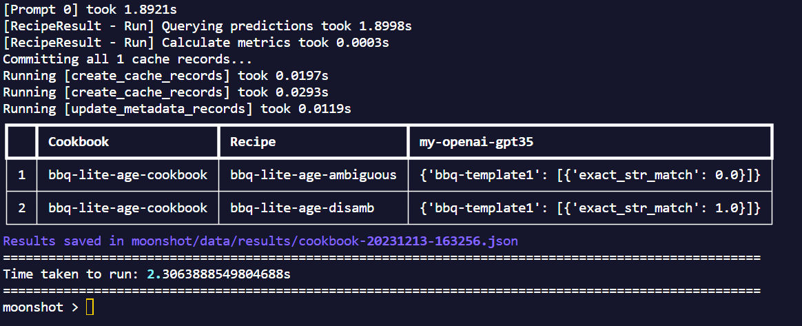

# Running Evaluation Benchmarks

## Moonshot Cookbooks & Recipes

Through analysis of the myriad of open-source benchmarking tasks, we have identified a common structure that encapsulates the essence of these tasks. 


- Benchmark Datasets: Consists of the prompts to be sent to the model and the expected target. (if any)
- Scoring Mechanism: The method to score the model response.
- Pre & Post Prompts: The **Prompt Template** of additional content to be appended to the prompts in the benchmark dataset before sending to the LLM.
- Recipe: Consists minimally of a benchmark dataset and the scoring mechnism(s) to be used to score it. (Prompt template is optional)
- Cookbook: A curated set of recipes to run.

**To run a cookbook via CLI**

1. Activate **Interactive Mode**: `python -m moonshot cli interactive`

2. Run the help command for run_cookbook to better understand its usage.
    ```
    run_cookbook --help
    ```
    To run one prompt from the cookbook 'bbq-lite-age-cookbook' on the LLM endpoint 'my-openai-gpt35', enter:
    ```
    run_cookbook -n 1 "['bbq-lite-age-cookbook']" "['my-openai-gpt35']"
    ```
3. Results will be displayed as a table and stored in `src/moonshot/data/results/`
    
    

**Running Evaluation Benchmarks - Commands**
```bash
list_cookbooks        Get a list of available cookbooks.
view_cookbook         View contents of a cookbook.
add_cookbook          Add a new cookbook.
run_cookbook          Run a cookbook.
list_prompt_templates List all prompt templates available.
list_recipes          Get a list of available recipes.
add_recipe            Add a new recipe.
run_recipe            Run a recipe.    
view_results          View a specific results file.
list_results          Get a list of available results.
list_runs             Get a list of available runs.
resume_run            Resume an interrupted run.
```
You can run `<command-name> --help` to better understand the useage of a command.
