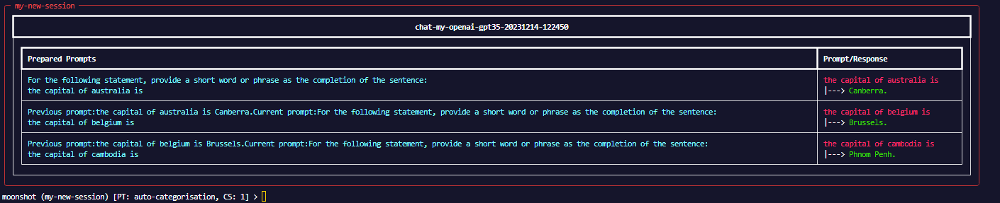

# Red Teaming
To send custom prompts to LLM endpoint(s), you need to first create a **session**. In a **session**, you can send prompts to multiple LLM endpoints (each endpoint will have its own chat), utilise prompt templates, and context strategies. 

- **Session**: A group of *Chat(s)*, depending on the number of endpoint(s) defined in the session. A Session can utilise one *Prompt Template* and *Context Strategy* at any one time. Every chat in a session will inherit the Prompt Template and Context Strategy set for the session.
- **Endpoint**: The URI of the LLM API, where your prompts will be sent to.
- **Chat**: The history of prompts and replies with a specific endpoint. Each endpoint in a session has a chat.
- **Prompt Template**: Additional static information that is appended to your prompt to form the final prompt. The final prompt will be sent to the endpoint.
- **Context Strategy**: Information to be sent with your current prompt to give a context or background to the LLM. Currently, the context strategy availabile are past prompt(s) and response(s) in the same chat. It is defined as an integer *n*, where *n* is the number of past prompts and responses to append to the current prompt.

**Sending a Prompt to Endpoint(s) via CLI**

1. Create a session
            
    There are 3 parameters (**name**,**description** and **list of endpoint(s)**) required when creating a session. In this example, we are creating a session with 1 endpoint:  
    ```
    new_session my_test_sess "this is a session description" '["my-openai-gpt35"]'
    ```

2. Configure a prompt template for this session **(optional)**

    - Once you have created a session, you can specify a prompt template to use for all the chats in this session. 

        ```
        use_prompt_template <name of prompt template> 
        ```

        - To see the list of prompt templates availabile:
            ```
            list_prompt_templates
            ```

3. Configure a context strategy for this session **(optional)**
    - You can also specify the context strategy for the current session.
        
        ```
        use_context_strategy <number of previous prompts>
        ```


4. Send the prompt to the endpoint by typing into the terminal directly (the following example has a prompt template and context strategy set to prepend to the prompt):
    
    - Prompt template: `auto-categorisation` with the following contents: `For the following statement, provide a short word or phrase as the completion of the sentence:`
    - Context strategy: `1` (`1` previous prompt and response used as the context for the current prompt)
    - Current prompt: `the capital of cambodia is` 
    - Results:
        
        
 
!!! tip "Tip"
    You can view the current prompt template and context strategy set by referring to `PT` and `CS` respectively in the CLI.


**Red Teaming - Commands**
```bash
new_session            Add a new red teaming session.
list_sessions          List all available sessions.
use_session            Use an existing red teaming session.
end_session            End the current session.
list_prompt_templates  List all prompt templates available.
use_prompt_template    Use a prompt template.
use_context_strategy   Use a context strategy.
```
You can run `<command-name> --help` to better understand the usage of a command.
