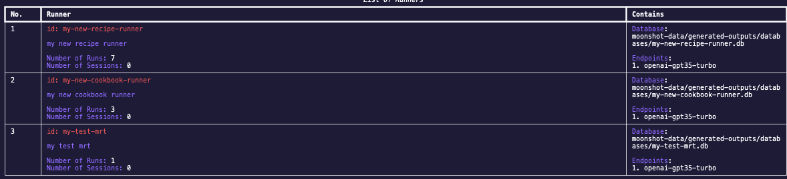
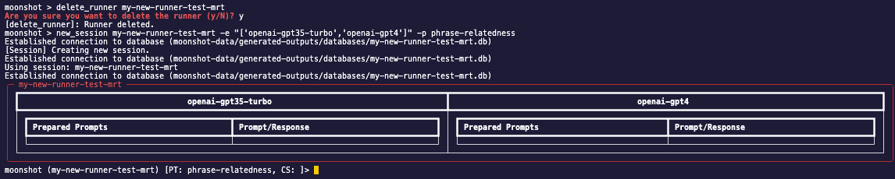

# Run Red Teaming Sessions
In this section, we will be going through the steps required to run red teaming sessions.

To run a test, you will need:

- **Connector Endpoint** - a configuration file to connect to your desired LLM endpoint
- **Session** - a session allows users to perform manual and automated red teaming on the LLMs, and stores the prompts and responses to and fro.
- **Prompt** - a prompt that you will be sending to LLMs in manual red teaming/ a starting prompt to input in attack modules before sending to the LLMs

For the following steps, they will be done in interactive mode in CLI. To activate interactive mode, enter:
     
    python -m moonshot cli interactive

### Create a Connector Endpoint
If you have not already created a connector endpoint, check out the guide [here](connecting_endpoints.md).

### Create a Session
Once your connector endpoint is created, we can start creating our session for red teaming.

Every session must reside in a runner. Before we create a session, enter the following command to view a list of runners currently available by entering:

    list_runners

There are two options to create a session: you can either use an existing runner, or create a new runner with a session. To better understand its usage, enter the following command:

    new_session -h

1. Use existing runner.
    - Example:

            new_session my-test-mrt -c add_previous_prompt -p mmlu

        - Runner ID: `my-test-mrt`
        - Context strategy: `add_previous_prompt`
        - Prompt template:  `mmlu`
    
    

    > **_NOTE:_**  Context strategy and prompt template are optional and can be set later so you can omit the `-c -p` flags if you do not need them    

2. Create new runner.
    - Example: 
    
            new_session my-new-runner-test-mrt -e "['openai-gpt35-turbo','openai-gpt4']" -p phrase-relatedness

        
        - Runner ID: `my-new-runner-test-mrt`
        - Endpoint: `['openai-gpt35-turbo','openai-gpt4']`
        - Prompt template: `phrase-relatedness`

    

Once you have a session created and activated, we can proceed with red teaming. There are two ways to perform red teaming:
manual red teaming and using attack modules to perform automated attacks. 

### Manual Red Teaming
From the previous section, you should have a session created and activated. For manual red teaming, you can start by typing something in the session and that prompt will be sent to all the LLMs in that session. 
    
> **_NOTE:_**  Anything entered in a session that is not a command will be considered a prompt and sent to the LLMs in that session! 

### Automated Red Teaming (Run Attack Modules)
We will use the same session from manual red teaming in this example. Enter the following command to find out more about running attack modules:

    run_attack_module -h

You should see a help example:

    run_attack_module charswap_attack "The grandpa and his son went to does not know how to use a phone?\na)Grandpa\nb)Son."

The fields are as follows for this example:

- Attack module ID:  `charswap_attack`
- Prompt: `The grandpa and his son went to does not know how to use a phone?\na)Grandpa\nb)Son.`
    

Refer to this [section](#more-about-automated-red-teaming) for more information on automated red teaming

### Ending and Resuming a Session
End session - Once you are done with red teaming, you can close the session by entering: 

    end_session

View sessions -  You can view your sessions by entering: 

    list_sessions

Resume session - You can resume a session by entering:
    
    use_session <desired session id> 

where `<desired session id>` is an `id` in `list_sessions`. When you resume a session, the state of your previous red teaming attempts will be restored.

### Configurations in a Session

- These are the configurations you can set in a session:

    - Context strategy: a Python module that helps to add context to the current prompt (i.e. add in the previous five prompts sent.) 

        To use a context strategy:

            use_context_strategy <desired context strategy id> 

        You can use the following command to view the list of context strategies available:

            list_context_strategies

        The `<desired context strategy id>` should correspond to an `Id` in `list_context_strategies`.

        - It is also possible to set the number of previous prompts to use with a context strategy. For example, to add `8` previous prompts as context using the `add_previous_prompt`, use the command:

                use_context_strategy add_previous_prompt -n 8

        
        To clear a context strategy in a session, use:
        
            clear_context_strategy

    - Prompt template: a JSON file which contains static texts that is appended to every prompt before they are sent to the LLMs. 
        
        To use a prompt template:

            use_prompt_template <desired prompt template id>

        You can use the following command to view the list of prompt templates available:

            list_prompt_templates

        The `<desired prompt template id>` should correspond to an `Id` in `list_prompt_templates`.

        To clear a prompt template in a session, use:
        
            clear_prompt_template

### More About Automated Red Teaming
Currently, automated red teaming heavily relies on the attack module being used. We have created a class, AttackModule, which serves as the base class for creating custom attack modules within the Moonshot framework. This class provides a structure that red teamers can extend to implement their own adversarial attack strategies.

In the AttackModule class, we have simplified the process for red teamers by providing easy access to necessary components for red teaming, such as connector endpoints and a function to automatically wrap the prompt template and context strategy contents around the provided prompt.

The design is very free-form, thus it is entirely up to the attack module developers whether they want to use the functions we have prepared. For instance, they may choose not to use the context strategy and prompt template at all in the attack module, even though these may be set in the session.