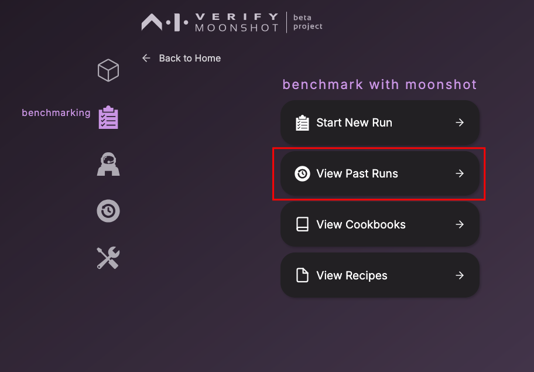

# Run Benchmarks

In this guide, you will learn how to

This section walks through the steps to start a benchmark run

- Unboxing Benchmarking module
- Launch Moonshot UI 
- Run Benchmarking through Portal

## Unboxing Benchmarking

Benchmarks consists of 3 main components:


- Cookbooks - Three main categories - IMDA Starter Kit, Capability, Trust & Safety. [Refer to all cookbooks here](https://github.com/aiverify-foundation/moonshot-data/tree/main/cookbooks).
- Recipes - [Refer to detailed list of all recipes here](https://github.com/aiverify-foundation/moonshot-data/tree/main/recipes).
- Datasets - These datasets contribute to recipes that are in-turn packaged into cookbooks. [Refer to the detailed list of all datasets here](https://github.com/aiverify-foundation/moonshot-data/tree/main/datasets).

## Launch Moonshot UI

Moonshot UI is designed to simplify the testing workflows. Once Moonshot is [installed](../getting_started/quick_install.md), you can start the Web UI using the  following command:

```
python -m moonshot web
```

Then, use your browser and navigate to `http://localhost:3000`

!!! note
    We will be testing a model from OpenAI in this guide. You will need to prepare an **OpenAI** token.

## Run Benchmark Test

This section walks through the steps to start a benchmark run

1. To begin, click on the "Run Benchmark" button as indicated


`2. Pick the desired endpoints for this benchmark run. You can also configure them at this point by clicking on their respective "edit" button. 

You may choose to connect to your own LLM application. Refer to this section for details. Once selected, 
Click on "NEXT" to proceed.


`3. Pick the desired cookbooks for this benchmark run.


You can click "About" to find out more about the cookbook, which will contain detailed information about the specific cookbook.


`4. Before you can start running benchmarks, you have to provide the following information. These will be included in the report generated at the end of the run.

| Field | Description | Example |
|-------|-------------|---------|
| **Name (Required)** | A unique name for you to identify this benchmark run. | GPT4 vs Claude on safety benchmarks |
| **Description (Optional)** | Describe the purpose and scope of this benchmark run. | Comparing GPT4 and Claude to determine which model is safer as a chatbot. |
| **Run a smaller set** | The number of prompts per dataset, as specified in the recipe, to be run. Indicating 0 will run the full set.<br><br>* Before running the full recommended set, you may want to run a smaller number of prompts from each recipe to do a sanity check. | 5 |


`5. Once a benchmark run is completed, you can click on "View Report"


**View Run History**

You can view the details of previous runs through 2 methods

* By clicking on "Benchmarking" icon on the Sidebar and click the "View Past Runs" button




* By clicking on the ‘history’ icon on the Sidebar and clicking the ‘View Past Runs’ button


This is the window that will list the information of the previous runs. For more detailed information of each run, click in the "View Results" button.


