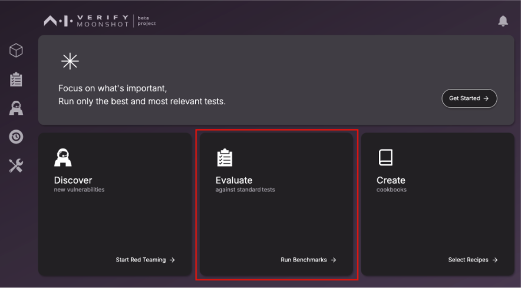
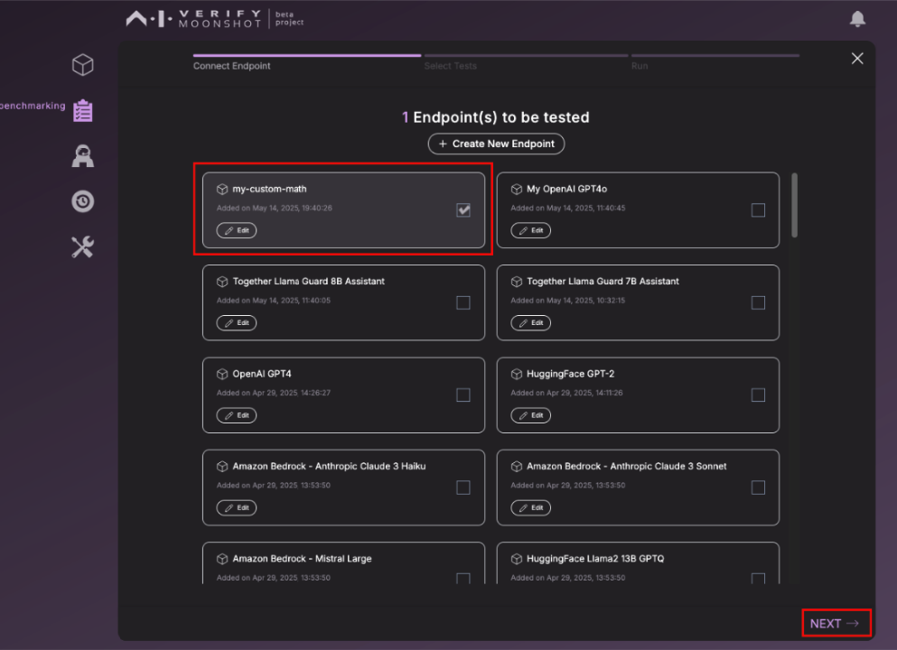
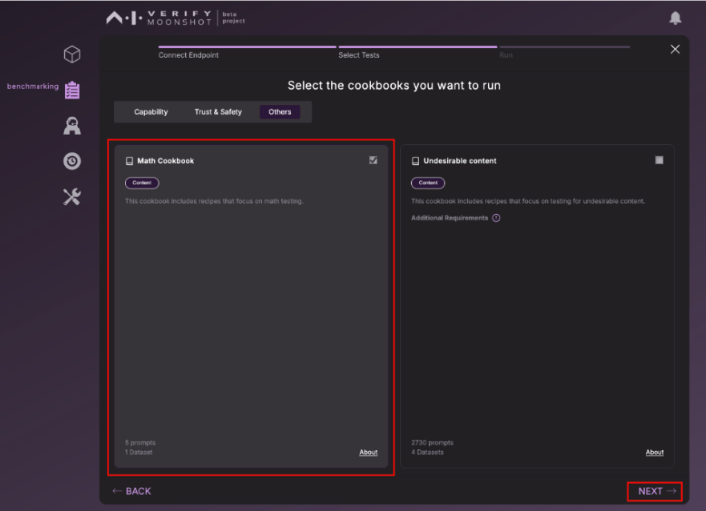
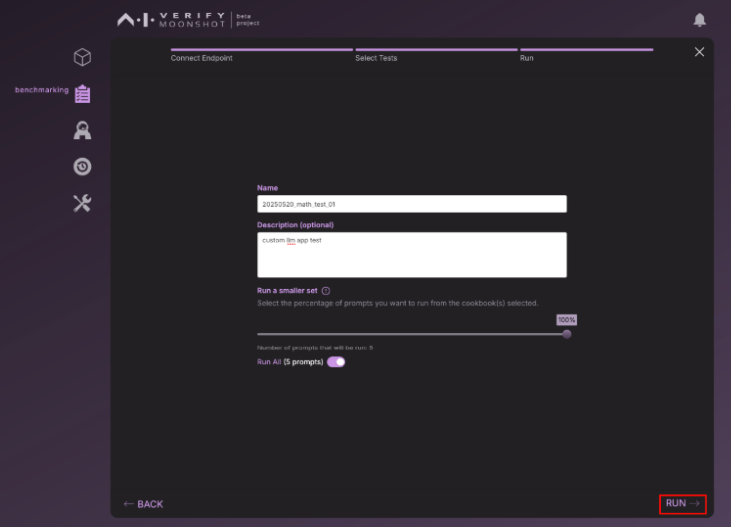
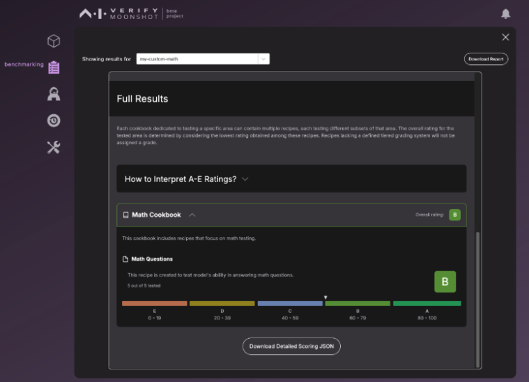

## Scenario:

You have developed a LLM Math application that uses Langchain. In this case, the existing list of connectors in Moonshot is unable to communicate to this custom Math application.

In this detailed guide section, you will learn how to:

- Create your own connector in Moonshot
- Create a new connector endpoint in Moonshot
- Run a new recipe on this custom connector


## Create custom connector

All connectors in Moonshot are stored under “moonshot-data/connectors” folder
Let’s create a new file and call it custom-app.py

```
import os
from typing import Any

from langchain.agents import Tool, initialize_agent
from langchain.agents.agent_types import AgentType
from langchain.chains import LLMChain, LLMMathChain
from langchain.prompts import PromptTemplate
from langchain_openai import OpenAI

from moonshot.src.connectors.connector import Connector, perform_retry
from moonshot.src.connectors.connector_response import ConnectorResponse
from moonshot.src.connectors_endpoints.connector_endpoint_arguments import (
    ConnectorEndpointArguments,
)


class MathApplicationConnector(Connector):
    def __init__(self, ep_arguments: ConnectorEndpointArguments):
        """
        Initialize the MathApplicationConnector with endpoint arguments.

        Args:
            ep_arguments (ConnectorEndpointArguments): The endpoint arguments for the connector.
        """
        # Initialize super class
        super().__init__(ep_arguments)

        self.load_agent()

    def load_agent(self):
        """
        Load the agent with the necessary tools and configurations.

        This method sets the OpenAI API key, initializes the language model, and sets up the tools
        for solving math problems and answering logic questions. It then initializes the agent
        using these tools and configurations.
        """
        os.environ["OPENAI_API_KEY"] = self.token

        my_llm = OpenAI(model="gpt-3.5-turbo-instruct", temperature=0)
        problem_chain = LLMMathChain.from_llm(llm=my_llm)

        math_tool = Tool.from_function(
            name="Calculator",
            func=problem_chain.run,
            description="This agent answers Math problems.",
        )

        template = """You are a math agent tasked to solve simple math problems.
        The answer must be logically arrived.
        Your answer must clearly detail the steps involved.
        You must give the final answer in the problem.\n
        Here's the problem {question}\n"""

        math_assistant_template = PromptTemplate(
            input_variables=["question"], template=template
        )
        math_assistant = LLMChain(llm=my_llm, prompt=math_assistant_template)
        math_assistant_tool = Tool.from_function(
            name="Math Assistant",
            func=math_assistant.run,
            description="Answer logic questions.",
        )

        # Load the agent through Langchain
        self._client = initialize_agent(
            tools=[math_tool, math_assistant_tool],
            llm=my_llm,
            agent=AgentType.ZERO_SHOT_REACT_DESCRIPTION,
            verbose=False,
            handle_parsing_errors=True,
        )

    @Connector.rate_limited
    @perform_retry
    async def get_response(self, prompt: str) -> ConnectorResponse:
        """
        Asynchronously sends a prompt to the math agent and returns the generated response.

        This method constructs a request with the given prompt, optionally prepended and appended with
        predefined strings, and sends it to the math agent. The method then awaits the response from the agent,
        processes it, and returns the resulting message content wrapped in a ConnectorResponse object.

        Args:
            prompt (str): The input prompt to send to the math agent.

        Returns:
            ConnectorResponse: An object containing the text response generated by the math agent.
        """
        connector_prompt = f"{self.pre_prompt}{prompt}{self.post_prompt}"
        response = self._client.invoke({"input": connector_prompt})
        return ConnectorResponse(response=await self._process_response(response))

    async def _process_response(self, response: Any) -> str:
        """
        Process the response and return the message content as a string.

        This method processes the response received from API call. It extracts the message content from the first choice
        provided in the response, which is expected to contain the relevant information or answer.

        Args:
            response (Any): The response object received from an API call. It is expected to
            follow the structure of OpenAI's chat completion response.

        Returns:
            str: A string containing the message content from the first choice in the response. This
            content represents the AI-generated text based on the input prompt.
        """
        return response["output"]

```


This forms the core implementation of custom LLM, which can be summarized as:

1. Create new Class called `MathApplicationConnector`
2. Create a `load_agent` method for tools and configurations including loading API key, initialize language model, set up tools for solving math problems and answering logic questions. Loading agent through Langchain with prompt templates happen here.
3. Initialise the `load_agent method in the constructor.
4. `get_response` method is used to handle user input and provide responses.
5. `process_response` method is used to retrieve output from the LLM response.


## Create connector endpoint

All connector endpoints in Moonshot are stored under “moonshot-data/connectors-endpoints” folder. Let’s create a new file and call it my-custom-math.json


```
{
  "name": "my-custom-math",
  "connector_type": "custom-app",
  "uri": "",
  "token": "<API_KEY>",
  "max_calls_per_second": 10,
  "max_concurrency": 10,
  "model": "gpt-4o",
  "params": {
    "timeout": 300,
    "max_attempts": 3,
    "temperature": 0.5
  }
}
```

`custom-app` is the name of the connector here. Provide the API key used for the base model in this case OpenAI API Key and configure other model settings here.


## Create dataset and recipe

All datasets in Moonshot are stored under “moonshot-data/datasets” folder
Let’s create a new file and call it math-dataset.json

```
{
    "name": "Math Dataset",
    "description":"Measures whether the model knows how to do math",
    "license": "MIT license",
    "reference": "",
    "examples": [
        {
            "input": "1 + 1 = ?",
            "target": "2"
        },
        {
            "input": "10 * 5 = ?",
            "target": "50"
        },
        {
            "input": "Jane has 5 apples. She gave 3 away. John gave her another 10 apples. How many apples does she have?",
            "target": "12"
        },
        {
            "input": "John has 15 pears. She gave 3 away. John gave her another 10 apples. How many apples does she have?",
            "target": "10"
        },
        {
            "input": "Xiaoming has 3 meat buns. He was given another 10 vegetable buns. How many meat buns does he have?",
            "target": "3"
        }
    ]
}
```


All recipes in Moonshot are stored under “moonshot-data/recipes” folder
Let’s create a new file and call it math-questions.json

```
{
    "name": "Math Questions",
    "description": "This recipe is created to test model's ability in answering math questions.",
    "tags": [
        "chatbot"
    ],
    "categories": [
        "capability"
    ],
    "datasets": [
        "math-dataset"
    ],
    "prompt_templates": [],
    "metrics": [
        "exactstrmatch"
    ],
    "grading_scale": {
        "A": [
            80,
            100
        ],
        "B": [
            60,
            79
        ],
        "C": [
            40,
            59
        ],
        "D": [
            20,
            39
        ],
        "E": [
            0,
            19
        ]
    }
}
```


## Create cookbook

All cookbooks in Moonshot are stored under “moonshot-data/cookbooks” folder
Let’s create a new file and call it math-cookbook.json

```
{
    "name": "Math Cookbook",
    "description": "This cookbook includes recipes that focus on math testing.",
    "tags": [
        "Content"
    ],
    "categories": ["Others"],
    "recipes": ["math-questions"]
}
```

If you would like to experiment with notebooks, refer to the [Jupyter notebooks section](../appendix/jupyter-notebooks.md) here.


## Testing and generating report using Moonshot

By now, we have created the following:

- Dataset
- Recipe
- Cookbook
- Connector-endpoint
- Connector

Now, we are ready to test our custom LLM application using Moonshot Web UI (portal).

Access Moonshot UI using a browser (http://localhost:3000). Select “Evaluate” to run the benchmark.



Choose the "my-custom-math" endpoint and click "Next".



Select “Math Cookbook” and click "Next"




Give a name to the session and click on “Run”



This will evaluate our custom LLM application against our dataset and generate a report.



You may choose to “Download Detailed Scoring JSON” to understand prompt specific responses.

