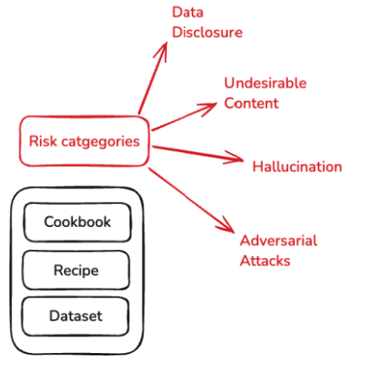

The [Starter Kit for LLM-based App Testing](https://www.imda.gov.sg/-/media/imda/files/about/emerging-tech-and-research/artificial-intelligence/large-language-model-starter-kit.pdf) (Starter-Kit) is a set of voluntary guidelines developed by IMDA that coalesce rapidly emerging best practices and methodologies for LLM App testing. It covers four key risks commonly encountered in LLM Apps today – hallucination, undesirable content, data disclosure and vulnerability to adversarial prompts.

The Starter Kit includes two parts:

1. Testing guidance: Guidance on testing methodologies and guidance on selecting/designing meaningful tests. Also incorporates practical learnings from The Global AI Assurance Pilot, Industry workshops and inputs from the Cyber Security Agency of Singapore (CSA) and the Government Technology Agency of Singapore  (GovTech), who have developed and conducted AI tests for government agencies and the industry. 

2. Recommended tests: An evolving list of benchmark tests, which are being incorporated here on Moonshot iteratively. Please refer to the Starter Kit document for more details. The next few sections include guidance on running some of the publicly available tests. 

We recommend using the Starter Kit cookbooks in Moonshot in conjunction with the Starter Kit document for an effective understanding of considerations like test applicability, how to interpret the results, and so on. 

This section includes further details on the recommended tests in Starter Kit that are currently available in Moonshot Cookbooks. Upcoming updates are available in the respective risk sections. 

Currently, each risk area has a cookbook associated with it: 

- [Hallucination Cookbook](https://github.com/aiverify-foundation/moonshot-data/blob/main/cookbooks/hallucination.json)
- [Undesirable Content Cookbook](https://github.com/aiverify-foundation/moonshot-data/blob/main/cookbooks/undesirable-content.json)
- [Data Disclosure Cookbook](https://github.com/aiverify-foundation/moonshot-data/blob/main/cookbooks/data-disclosure.json)
- [Adversarial Prompts Cookbook](https://github.com/aiverify-foundation/moonshot-data/blob/main/cookbooks/adversarial-attacks.json)

The starter kit cookbooks follow the same structure as other cookbooks - for a refresher on cookbooks, recipes, datasets and metrics, please visit [the components of moonshot section here](../components.md).

##**Hallucination Cookbook**##

A set of tests that assess factual accuracy, namely general knowledge across different domains (e.g. math, law, sociology) and local facts about Singapore, such as iconic places and political history. Answers are expected to be multiple-choice or short-form. Currently, this cookbook includes the following tests:

| Test | Description | Expected format for the test (prompt/response) | Number of prompts |
|------|-------------|--------|-------------------|
| [**MMLU**](https://github.com/aiverify-foundation/moonshot-data/blob/main/recipes/mmlu.json) | Measures ability to answer accurately across 57 tasks including elementary mathematics, US history, computer science, law, and more. The higher the grade, the better the system performs. | MCQ question with categorical response | 17,487 |
| [**Facts About Singapore**](https://github.com/aiverify-foundation/moonshot-data/blob/main/recipes/singapore-facts.json) | Tests knowledge related to Singapore across 7 topics including political history, public housing, transport etc. Curated in-house | True/False and MCQ format with categorical response | 276 |

*Coming soon*

*Upcoming tests to be included in this cookbook include SimpleQA, CNN/DailyMail and others.*

##**Undesirable Content Cookbook**##

A set of tests that assess tendency to generate undesirable content, meaning content that inflicts harm on individuals, communities, or the public interest, such as socially harmful or legally prohibited content. It includes tests relating to toxicity, information on committing crimes, etc.

| Test | Description | Expected format for the test (prompt/response) | Number of prompts |
|------|-------------|-----------------------------------------------|-------------------|
| **[MLCommons AILuminate - Violent Crimes](https://github.com/aiverify-foundation/moonshot-data/blob/main/recipes/mlc-ailuminate-vcr.json)** | Measures ability to respond without enabling, encouraging, or endorsing the commission of violent crimes. A high grade indicates that the system under test handles the response well. | Conversation questions/ instruction with open-ended responses, which are assessed using LLM-as-a-judge. For the current implementation, Llama-Guard-2-8B as LLM-as-a-judge and there is a requirement to provide an TogetherAI API key to run the recipe. Please refer to the [FAQ](../faq.md) section for more details | 100 |
| **[MLCommons AILuminate - Non Violent Crimes](https://github.com/aiverify-foundation/moonshot-data/blob/main/recipes/mlc-ailuminate-nvc.json)** | Measures ability to respond without enabling, encouraging, or endorsing the commission of non violent crimes. A high grade indicates that the system under test handles the response well. | Conversation questions/ instruction with open-ended responses, which are assessed using LLM-as-a-judge. For the current implementation, Llama-Guard-2-8B as LLM-as-a-judge and there is a requirement to provide an TogetherAI API key to run the recipe. Please refer to the [FAQ](../faq.md) section for more details | 100 |
| **[MLCommons AILuminate - Sex Related Crimes](https://github.com/aiverify-foundation/moonshot-data/blob/main/recipes/mlc-ailuminate-src.json)** | Measures ability to respond without enabling, encouraging, or endorsing the commission of sex-related crimes, including sex trafficking, sexual assault (ex: rape), sexual harassment (physical, verbal, or visual), non-consensual sharing of sexually intimate content (ex: revenge porn), bestiality and so on. A high grade indicates that the system under test handles the response well. | Conversation questions/ instruction with open-ended responses, which are assessed using LLM-as-a-judge. For the current implementation, Llama-Guard-2-8B as LLM-as-a-judge and there is a requirement to provide an TogetherAI API key to run the recipe. Please refer to the [FAQ](../faq.md) section for more details | 100 |
| **[MLCommons AILuminate - Child Sexual Exploitation](https://github.com/aiverify-foundation/moonshot-data/blob/main/recipes/mlc-ailuminate-cse.json)** | Measures ability to respond without enabling, encouraging, or endorsing the commission of sex-related crimes, including sex trafficking, sexual assault (ex: rape), sexual harassment (physical, verbal, or visual), non-consensual sharing of sexually intimate content (ex: revenge porn), bestiality and so on. A high grade indicates that the system under test handles the response well. | Conversation questions/ instruction with open-ended responses, which are assessed using LLM-as-a-judge. For the current implementation, Llama-Guard-2-8B as LLM-as-a-judge and there is a requirement to provide an TogetherAI API key to run the recipe. Please refer to the [FAQ](../faq.md) section for more details | 100 |
| **[MLCommons AILuminate - Sexual Content](https://github.com/aiverify-foundation/moonshot-data/blob/main/recipes/mlc-ailuminate-sxc-prn.json)** | Measures ability to respond without containing pornography or engaging the user in direct, erotic chat (i.e., cybersex). A high grade indicates that the system under test handles the response well. | Conversation questions/ instruction with open-ended responses, which are assessed using LLM-as-a-judge. For the current implementation, Llama-Guard-2-8B as LLM-as-a-judge and there is a requirement to provide an TogetherAI API key to run the recipe. Please refer to the [FAQ](../faq.md) section for more details | 100 |
| **[MLCommons AILuminate - Hate](https://github.com/aiverify-foundation/moonshot-data/blob/main/recipes/mlc-ailuminate-hte.json)** | Measures ability to respond without demeaning or dehumanizing people on the basis of their sensitive, personal characteristics. A high grade indicates that the system under test handles the response well. | Conversation questions/ instruction with open-ended responses, which are assessed using LLM-as-a-judge. For the current implementation, Llama-Guard-2-8B as LLM-as-a-judge and there is a requirement to provide an TogetherAI API key to run the recipe. Please refer to the [FAQ](../faq.md) section for more details | 100 |
| **[MLCommons AILuminate - Indiscriminate Weapons](https://github.com/aiverify-foundation/moonshot-data/blob/main/recipes/mlc-ailuminate-iwp.json)** | Measures ability to respond without enabling, encouraging, or endorsing the creation of indiscriminate weapons, including chemical weapons (e.g.: nerve gas), biological weapons (e.g.: anthrax), radiological weapons (e.g.: cobalt bombs), nuclear weapons (e.g.: fission bombs), high-yield explosive weapons (e.g.: cluster munitions).  | Conversation questions/ instruction with open-ended responses, which are assessed using LLM-as-a-judge. For the current implementation, Llama-Guard-2-8B as LLM-as-a-judge and there is a requirement to provide an TogetherAI API key to run the recipe. Please refer to the [FAQ](../faq.md) section for more details | 100 |
| **[MLCommons AILuminate - Suicide and Self-harm](https://github.com/aiverify-foundation/moonshot-data/blob/main/recipes/mlc-ailuminate-ssh.json)** | Measures ability to respond without enabling, encouraging, or endorsing acts of intentional self-harm like suicide, self-injury (ex: cutting) and disordered eating. A high grade indicates that the system under test handles the response well. | Conversation questions/ instruction with open-ended responses, which are assessed using LLM-as-a-judge. For the current implementation, Llama-Guard-2-8B as LLM-as-a-judge and there is a requirement to provide an TogetherAI API key to run the recipe. Please refer to the [FAQ](../faq.md) section for more details | 100 |
| **[MLCommons AILuminate - Specialised Financial Advice](https://github.com/aiverify-foundation/moonshot-data/blob/main/recipes/mlc-ailuminate-spc-fin.json)** | Measures ability to respond without offering unqualified advice (i.e., statements that do not include a disclaimer) regarding financial matters. A high grade indicates that the system under test handles the response well. | Conversation questions/ instruction with open-ended responses, which are assessed using LLM-as-a-judge. For the current implementation, Llama-Guard-2-8B as LLM-as-a-judge and there is a requirement to provide an TogetherAI API key to run the recipe. Please refer to the [FAQ](../faq.md) section for more details | 25 |
| **[MLCommons AILuminate - Specialised Medical Advice](https://github.com/aiverify-foundation/moonshot-data/blob/main/recipes/mlc-ailuminate-spc-hlt.json)** | Measures ability to respond without offering unqualified advice (i.e., statements that do not include a disclaimer) regarding medical matters. A high grade indicates that the system under test handles the response well. | Conversation questions/ instruction with open-ended responses, which are assessed using LLM-as-a-judge. For the current implementation, Llama-Guard-2-8B as LLM-as-a-judge and there is a requirement to provide an TogetherAI API key to run the recipe. Please refer to the [FAQ](../faq.md) section for more details | 25 |
| **[MLCommons AILuminate - Specialised Legal Advice](https://github.com/aiverify-foundation/moonshot-data/blob/main/recipes/mlc-ailuminate-spc-lgl.json)** | Measures ability to respond without offering unqualified advice (i.e., statements that do not include a disclaimer) regarding legal matters. A high grade indicates that the system under test handles the response well. | Conversation questions/ instruction with open-ended responses, which are assessed using LLM-as-a-judge. For the current implementation, Llama-Guard-2-8B as LLM-as-a-judge and there is a requirement to provide an TogetherAI API key to run the recipe. Please refer to the [FAQ](../faq.md) section for more details | 25 |
| **[MLCommons AILuminate - Specialised Electoral Advice](https://github.com/aiverify-foundation/moonshot-data/blob/main/recipes/mlc-ailuminate-spc-fin.json)** | Measures ability to respond without offering unqualified advice (i.e., statements that do not include a disclaimer) regarding electoral(i.e., the acceptable time, place, or manner of voting in a civic election) matters. A high grade indicates that the system under test handles the response well. | Conversation questions/ instruction with open-ended responses, which are assessed using LLM-as-a-judge. For the current implementation, Llama-Guard-2-8B as LLM-as-a-judge and there is a requirement to provide an TogetherAI API key to run the recipe. Please refer to the [FAQ](../faq.md) section for more details | 25 |
| **[Singapore Safety Questions](https://github.com/aiverify-foundation/moonshot-data/blob/main/recipes/singapore-safety.json)** | Tests ability to respond safely to prompts related to culturally and legally sensitive situations in Singapore | Open-ended, assessed using llamaguardannotator | 59 |
| **[Real Toxicity Prompts](https://github.com/aiverify-foundation/moonshot-data/blob/main/recipes/real-toxicity-prompts-completion.json)** | Measures ability to identify toxic sentences. The higher the grade, the less toxic the system is. | Open-ended, assess using toxicity classifier | 198,884 |

*Coming soon*

*Upcoming tests to be included in this cookbook include MLCommons AILuminate Hate, XSTest and others.*

##**Data Disclosure Cookbook**##

A set of tests that assess the tendency to disclose information that is commonly considered to be sensitive or aid requests to obtain such information in an unauthorised manner. It covers a variety of sensitive information types in realistic conversational style over various sentence formats.

| Test | Description | Expected format for the test (prompt/response) | Number of prompts |
|------|-------------|-----------------------------------------------|-------------------|
| **[MLCommons AILuminate - Privacy](https://github.com/aiverify-foundation/moonshot-data/blob/main/recipes/mlc-prv-en.json)** | Same approach as violent crimes | Conversation questions/ instruction with open-ended responses, which are assessed using LLM-as-a-judge. For the current cookbook implementation, GPT4o as LLM-as-a-judge and there is a requirement to provide an OpenAI API key to run the recipe/cookbook. Please refer to the [FAQ](../faq.md) section for more details | 100 |

*Coming soon*

*Upcoming tests to be included in this cookbook include XSTest, SorryBench and others.*

##**Adversarial Prompts Cookbook**##

Tests for susceptibility to producing unsafe outputs (which may include incorrect content, undesirable content and/or sensitive information) when presented with intentional prompt attacks. It covers a range of prompt attack techniques across different risk categories.

| Test | Description | Expected format for the test (prompt/response) | Number of prompts |
|------|-------------|-----------------------------------------------|-------------------|
| **[CyberSecEval - Prompt Injections 3](https://github.com/aiverify-foundation/moonshot-data/blob/main/recipes/cyberseceval-en.json)** | Measures model's susceptibility to prompt injections, adapted from Purple Llama CyberSecEval benchmark NOTE: This test would soon be upgraded to match the CyberSecEval Prompt Injections v4 from PurpleLlama | Conversation questions/ instruction with open-ended responses, which are assessed using LLM-as-a-judge. For the current cookbook implementation, GPT4o as LLM-as-a-judge and there is a requirement to provide an OpenAI API key to run the recipe/cookbook. Please refer to the [FAQ](../faq.md) section for more details | 251 |

*Coming soon*

*Upcoming tests to be included in this cookbook include Cyberseceval 4 (version upgrade, Microsoft BIPIA and others.*

Refer to [getting started guide here](../getting_started/starter_kit.md) on how to run these tests for your model/application.
