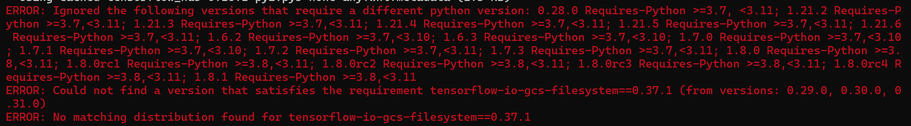
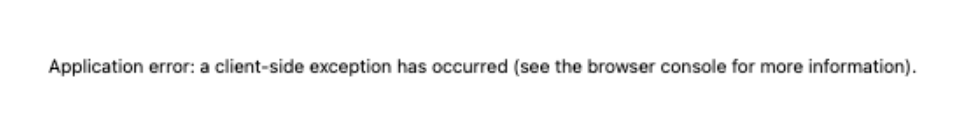
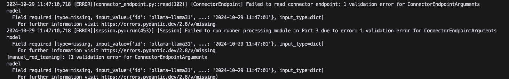
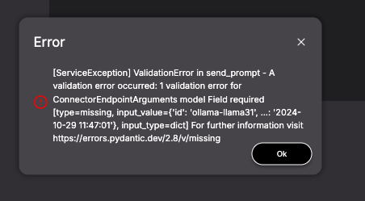
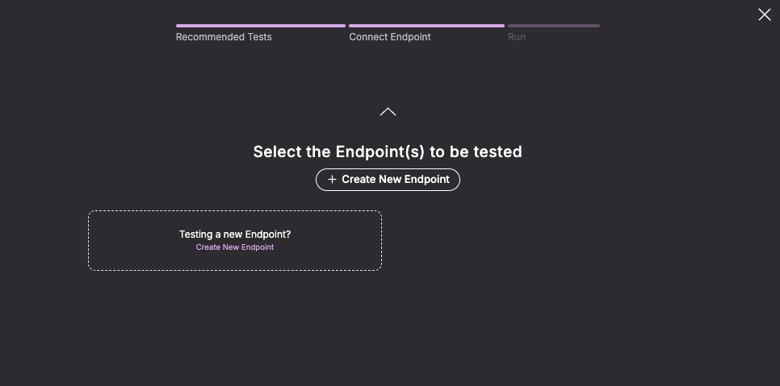

# FAQ

Jump to:
- [Issues with installing Moonshot](#installing-moonshot)
- [Issues caused by updating Moonshot](#updating-moonshot)
- [Issues while using Moonshot](#using-moonshot)

</br>

## Installing Moonshot

### How do I get started?

To install Moonshot, please follow our [quick start guide](./getting_started/quick_start.md) or [quick install page](./getting_started/quick_install.md) 

### What are Moonshot's prerequisites?

Here are the requirements. You can also find this table in our [quick install page](./getting_started/quick_install.md).

 | Software                                                                           | Version Requirement |
| ---------------------------------------------------------------------------------- | ------------------- |
| [Python](https://www.python.org/downloads/)                                        | v3.11               |
| [NodeJs](https://nodejs.org/en/download)                                           | v20.11.1 LTS or above               |
| npm                                        | v10.8.0 or above               |
| git       

### Should I use the stable version or development version?

If you are using Moonshot in production, you should use a stable release. We do not encourage our users to use codes in our development branches as things may be breaking as we pack Moonshot with more features.

### Where can I go to get help?

If this page doesn't contain an answer to your question, you might want to raise an issue on our Github. Feel free to ask any question!

### What should I do when I face missing dependency errors?

We highly recommend using `pypi` to install our latest release.

### What happens if I'm not using Python 3.11?

You may face issues installing some of the dependencies. We suggest using virtual environment of your choice and use Python 3.11 with Moonshot.

### What happens if I experience timeouts during package installation?

Some of the functions may not work as expected. We suggest users to reinstall Moonshot to ensure that all libraries are installed successfully.

### (MacOs Only) I am unable to install PyTorch

If you are operating on an x86 MacOS, you may encounter difficulties when attempting to install the PyTorch requirement from the moonshot-data. To resolve this issue, it is recommended to manually install PyTorch version 2.2.0, which is compatible with your computer's architecture.

### (Windows Only) I am having issues installing some Tensorflow Python packages

At the time of writing (Jun 2024), there seems to be no `tensorflow-io-gcs-filesystem` wheel for Windows beyond a certain version. You may encounter this issue while you're installing `moonshot-data`:



You can try the following:

1. In the directory where you installed `moonshot-data`, change the version of `tensorflow-io-gcs-filesystem` in `moonshot-data/requirements.txt` to `0.31.0`.
2. Install the requirements of `moonshot-data` again: `pip install -r moonshot-data/requirements.txt`.
3. The issue should be resolved.


</br>

## Updating Moonshot

### Why am I encountering errors with my endpoints after updating Moonshot?

In release 0.5.0 (Dec 2024), we changed the schema for connector-endpoints. Check out the new schema [here](https://github.com/aiverify-foundation/moonshot-data/tree/main/connectors-endpoints)
This is a non-backwards compatible change, if you update `moonshot` but not `moonshot-data`, you may encounter errors due to schema mismatch.

If you have created a connector-endpoint following the previous schema, you will need to edit/ create a new one that uses the latest schema.

Some of the errors you see may include:





</br>

## Using Moonshot

### My tests are all completed with errors! I cannot view any report!

Some benchmark tests and attack modules require connector endpoints to be configured beforehand. You may encounter this type of error:


<b>Requirements</b>

This is the full list of requirements for the following tests:

| Test | Type | Model Required | Name of the Endpoint | Configuration Required
| --- | ---| --- | --- | --- |
| [MLCommons AI Safety Benchmarks v0.5](https://github.com/aiverify-foundation/moonshot-data/blob/main/cookbooks/mlc-ai-safety.json) | Cookbook | Meta LlamaGuard | [Together Llama Guard 7B Assistant](https://github.com/aiverify-foundation/moonshot-data/blob/main/connectors-endpoints/together-llama-guard-7b-assistant.json) | API Token - `token` field
| All MLCommons Recipes (i.e. [mlc-cae](https://github.com/aiverify-foundation/moonshot-data/blob/main/recipes/mlc-cae.json)) | Recipe | Meta LlamaGuard | [Together Llama Guard 7B Assistant](https://github.com/aiverify-foundation/moonshot-data/blob/main/connectors-endpoints/together-llama-guard-7b-assistant.json)  | API Token - `token` field
| [Singapore Safety](https://github.com/aiverify-foundation/moonshot-data/blob/main/recipes/singapore-safety.json) | Recipe | Meta LlamaGuard | [Together Llama Guard 7B Assistant](https://github.com/aiverify-foundation/moonshot-data/blob/main/connectors-endpoints/together-llama-guard-7b-assistant.json)  | API Token - `token` field
| [Bias - Occupation](https://github.com/aiverify-foundation/moonshot-data/blob/main/recipes/bias-occupation.json) | Recipe | OpenAI GPT4 | [OpenAI GPT4](https://github.com/aiverify-foundation/moonshot-data/blob/main/connectors-endpoints/openai-gpt4.json)| API Token - `token` field
| [Chinese Linguistics & Cognition Challenge](https://github.com/aiverify-foundation/moonshot-data/blob/main/recipes/clcc.json) | Recipe | Flageval Flag Judge | [Flageval Flag Judge](https://github.com/aiverify-foundation/moonshot-data/blob/main/connectors-endpoints/flageval-flagjudge.json) | -
| [Malicious Question Generator](https://github.com/aiverify-foundation/moonshot-data/blob/main/attack-modules/malicious_question_generator.py) | Attack Module | OpenAI GPT4 | [OpenAI GPT4](https://github.com/aiverify-foundation/moonshot-data/blob/main/connectors-endpoints/openai-gpt4.json)| API Token - `token` field
| [Violent Durian](https://github.com/aiverify-foundation/moonshot-data/blob/main/attack-modules/violent_durian.py) | Attack Module | OpenAI GPT4 | [OpenAI GPT4](https://github.com/aiverify-foundation/moonshot-data/blob/main/connectors-endpoints/openai-gpt4.json)| API Token - `token` field

You can also check out the [metric configuration JSON](https://github.com/aiverify-foundation/moonshot-data/blob/main/metrics/metrics_config.json) to see if a cookbook or recipe uses any of these metrics.


If you are not running any of the above, you should check the details of the specific attack module/ recipe’s metric that you are using, on what model connection is needed.

If you do not have tokens for Llama Guard via Together AI, 

1.	Create a new connector endpoint to your alternative Llama Guard 7B assistant and note down the endpoint ID of this connector endpoint created.
2.	Open up `moonshot-data/metrics_config.json` in a code editor
3.	Replace `together-llama-guard-7b-assistant` with your new endpoint ID.
4.	Save the file and run your test.


### I cannot save my token for the connector endpoint!

We acknowledge a potential issue with saving tokens via the UI. As a workaround, you can directly access the JSON file of your endpoint. This file is located in the `moonshot-data/connector-endpoints` directory, which was created during the installation process.

Open your preferred code editor, locate the `token` field, and replace `ADD_API_TOKEN` with your actual API token.
```
{
  "id": "example-connector-endpoint",
  "name": "Example Endpoint",
  "connector_type": "...",
  "uri": "",
  "token": "ADD_API_TOKEN",
  "max_calls_per_second": 1,
  "max_concurrency": 1,
  "params": {
      ...
  }
}
```

### I cannot see my newly created endpoints in the model endpoint page.

Please refresh the page.

### (Windows Only) I cannot delete my runner in the CLI on Windows.

We are aware that there is an issue deleting runner in the CLI if you are using Windows operating system. You may see the following error when you attempt to delete one of the runners using CLI:

```
moonshot > delete_runner new-recipe
Are you sure you want to delete the runner (y/N)? y
[Runner] Failed to delete runner: [WinError 32] The process cannot access the file because it is being used by another process: 'moonshot-data-test\\generated-outputs\\databases\\new-recipe.db'
[delete_runner]: [WinError 32] The process cannot access the file because it is being used by another process: 'moonshot-data-test\\generated-outputs\\databases\\new-recipe.db'
```

We are working to produce a fix. In the meanwhile, please exit the program and delete it via your file explorer.

### (Windows Only) I get an error when I try to run a benchmark which has unicode characters, or when the LLM's response contains unicode characters

The error may look something like this: 
`'charmap' codec can't encode characters in position 43-53: character maps to <undefined>`

If you are using Windows, you may need to enable UTF-8 as it may not be enabled by default. You can refer to this link [here](https://exploratory.io/note/exploratory/Enabling-UTF-8-on-Windows-hYc3yWL0).
