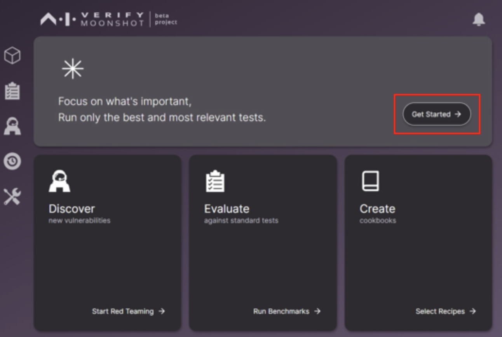
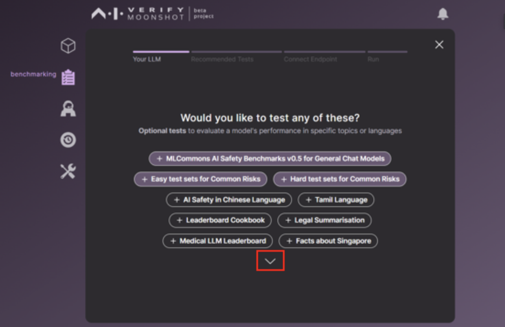
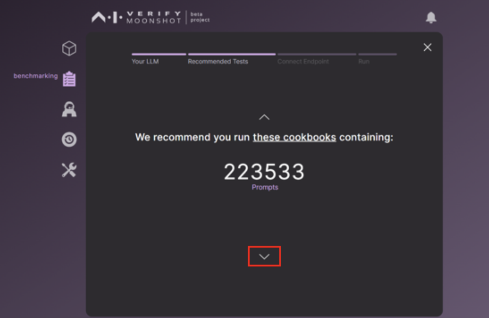
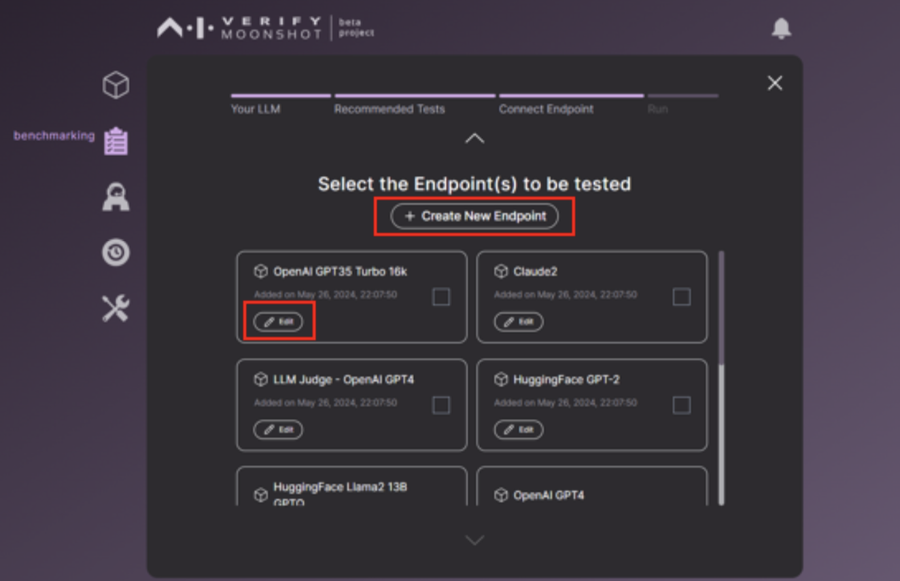
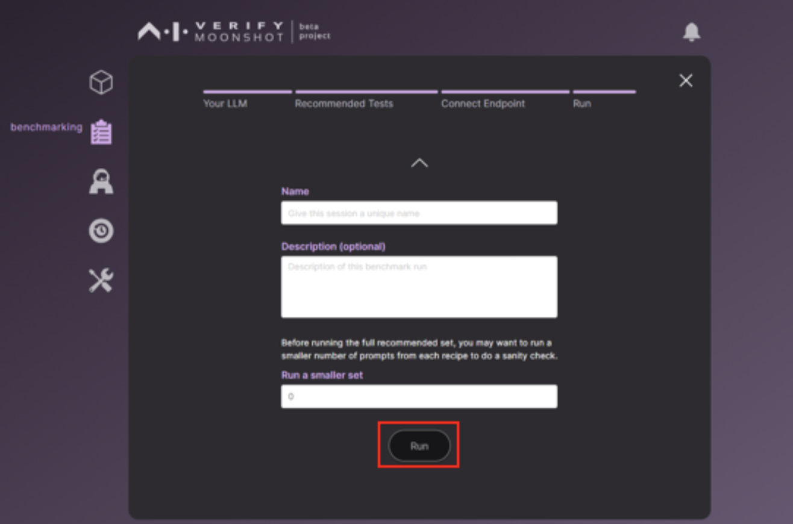
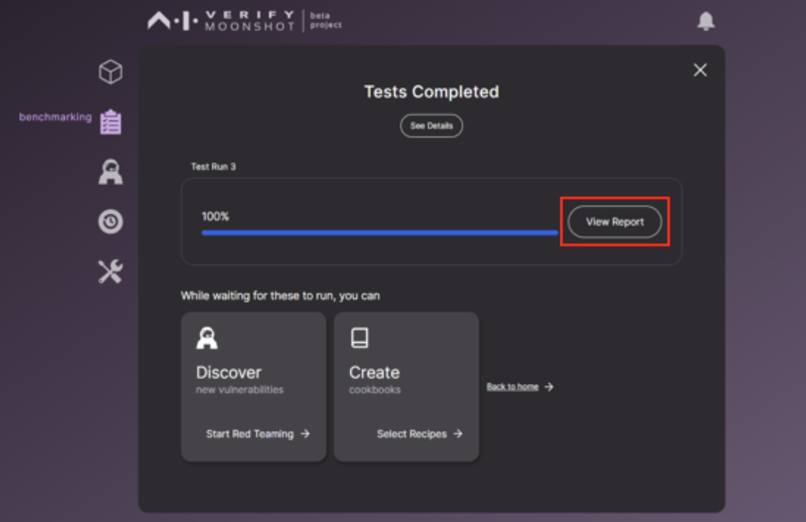

# Running your first test

Our Moonshot UI is designed to simplfy the testing workflow. Use your browser and navigate to `http://localhost:3000`

## Benchmark

Upon opening the webpage, click on "Get Started" as shown in the screen below.

This will bring you to a step-by-step wizard to run benchmark testing.

In the first page, click on any optional tests that is listed in screen.

After you have selected a list of tests, click the "down arrow" to go to the next page.

Click on edit endpoint and add an OpenAI API Token to one of the OpenAI endpoints. Once done, click on the "down arrow" to go to the next page.

Click on run to execute the test. You will be greeted with a progress bar after this page.

### View The report

Once the test is completed, click on "View Report".

