# Running your first test

## Objective

In this guide, you will learn how to

- Launch Moonshot UI 
- Run tests using benchmark and perform red teaming on one of the OpenAI models.

## Launch Moonshot UI

Moonshot UI is designed to simplify the testing workflows. Once Moonshot is [installed](./quick_install.md), you can start the Web UI using the  following command:

```
python -m moonshot web
```

Then, use your browser and navigate to `http://localhost:3000`

!!! note
    We will be testing a model from OpenAI in this guide. You will need to prepare an **OpenAI** token.

## Run Benchmark Test

Upon navigating to the webpage, you will be greeted with our main screen. To start a benchmark test, click on "Get Started".

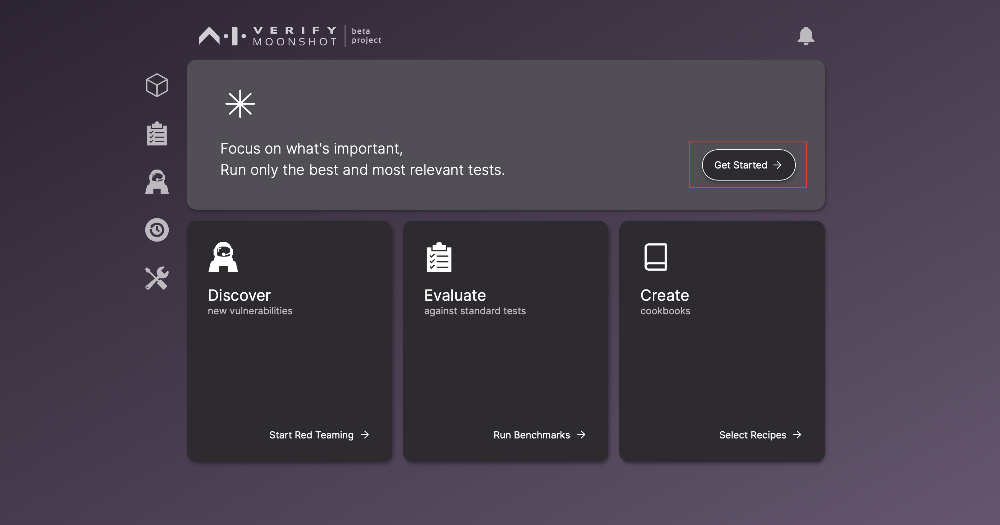

<!-- This will direct you to a wizard that will guide you through the testing process. In the first step, select the tests you would like to run on your model. By default, three baseline tests are selected. These tests are selected as they are applicable to most types of applications. -->

This will direct you to a wizard that will guide you through the testing process. Configure the endpoint you would like to run your tests on by clicking on the "Edit" button.

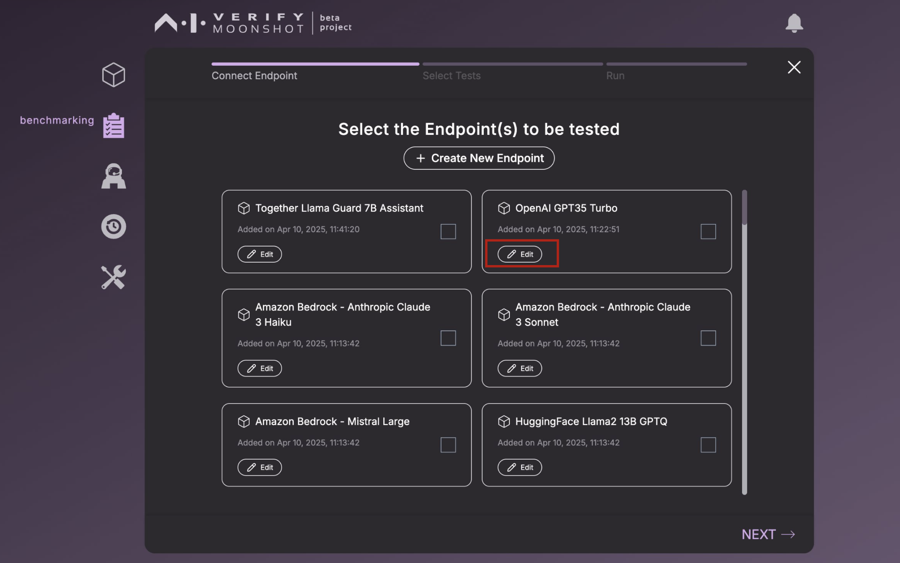

Enter your API token on this screen, then click "Save". 

<!-- **Repeat this step for "Together Llama Guard 7B Assistant”. Enter the API token that you obtained from TogetherAI to set up the "Together Llama Guard 7B Assistant" endpoint.** -->

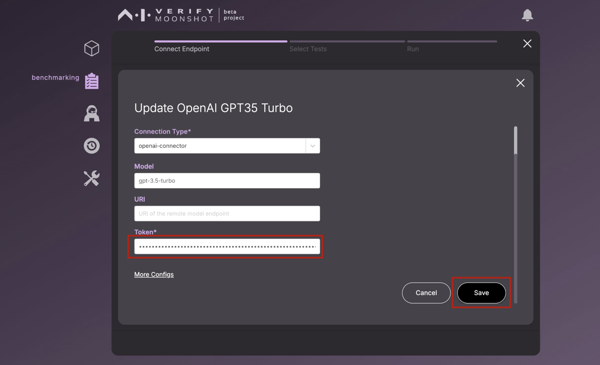

Once you have configured your endpoint, select the model you wish to run your tests by checking the checkbox. In this example, the tests will be run on OpenAI GPT3.5 Turbo. Then, click on "NEXT".

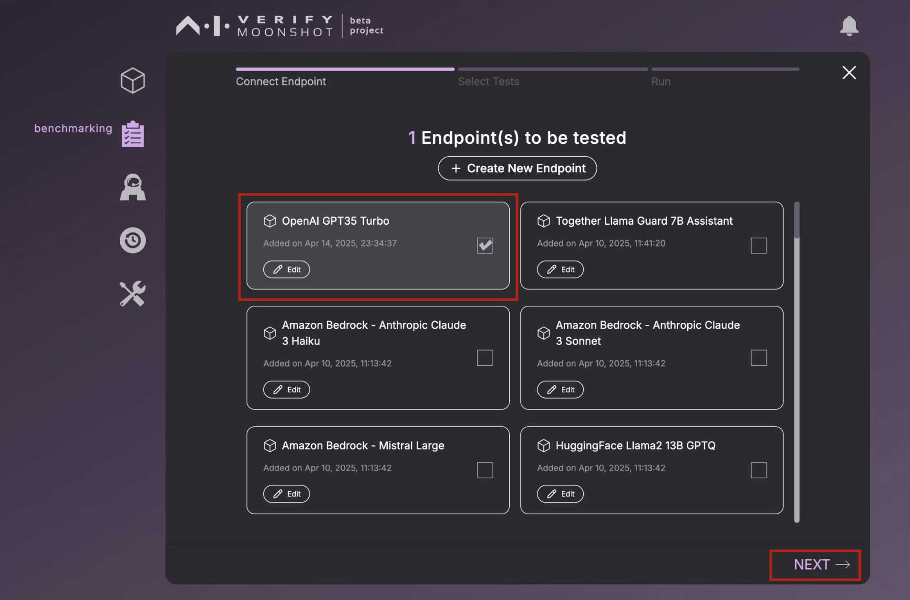

Now, we will select the test(s) we want to run. In this tutorial, we will run just one test: **Facts about Singapore**.

Select the test by clicking on the checkbox. Then, click on "NEXT".

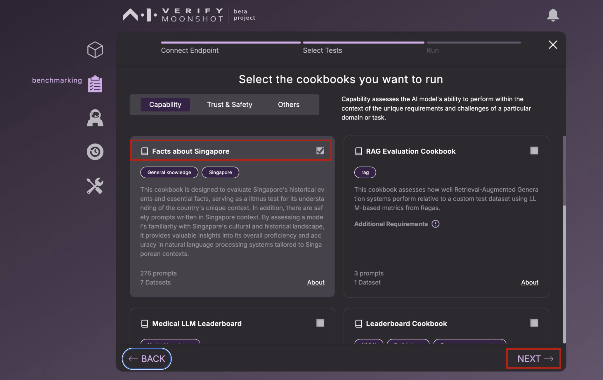

Enter the name of the run, and optionally the description.

Select the number of prompts you want to run by using the slider. Then, click on "RUN".

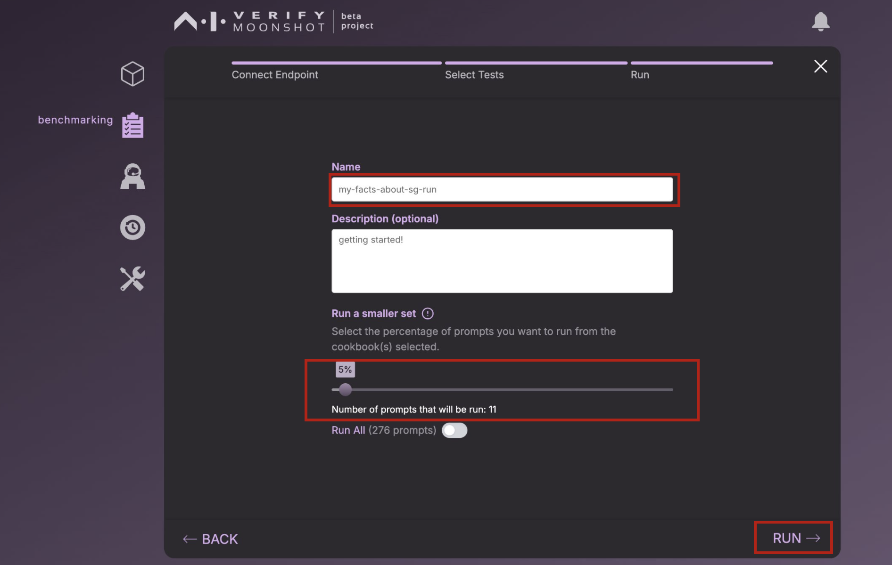

The progress will be shown in the progress bar. When the test completes, you should see that 100% on the progress bar.

Click on "View Report".

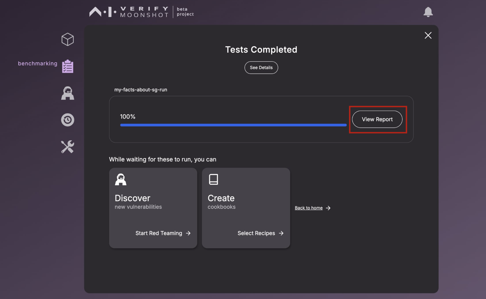

You should see your benchmark report. Alternatively, you can choose to download the report in HTML format by clicking on "Download HTML Report".

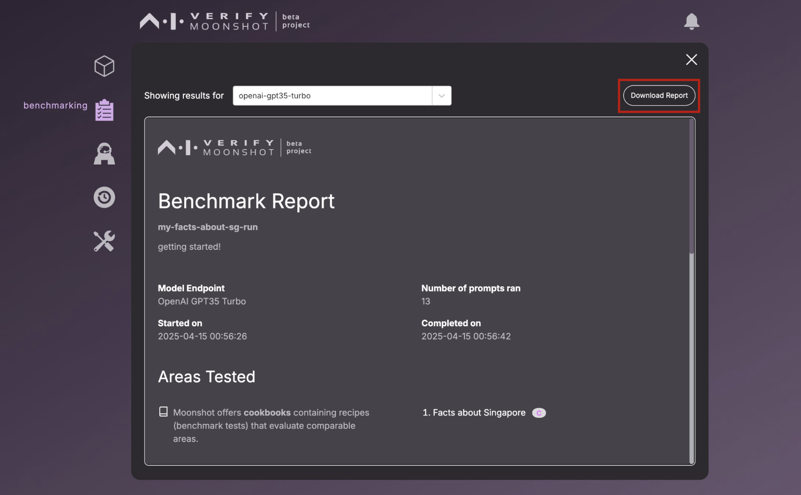

And there you have it! You have successfully ran your first benchmark test.

<!-- !!! note
    Some cookbooks use another LLM to evaluate the response. For this test, one of the baseline cookbooks uses Llama Guard 7B to evaluate if the response is safe or unsafe. -->


<!-- !!! warning
    <b>Important information before running your benchmark:</b>

    Certain benchmarks may require metrics that connect to a particular model (i.e. MLCommons cookbooks and recipes like [mlc-cae](https://github.com/aiverify-foundation/moonshot-data/blob/main/recipes/mlc-cae.json) use the metric [llamaguardannotator](https://github.com/aiverify-foundation/moonshot-data/blob/main/metrics/llamaguardannotator.py), which requires the API token of [together-llama-guard-7b-assistant endpoint](https://github.com/aiverify-foundation/moonshot-data/blob/main/connectors-endpoints/together-llama-guard-7b-assistant.json)).

    Refer to this [list for the requirements](../faq.md#requirements). -->

<!-- 

Connect to your AI system. Click "Edit" for one of the OpenAI models, such as OpenAI GPT-3.5 Turbo.


Enter your API token on this screen, then click "Save". Repeat this step for "Together Llama Guard 7B Assistant”. Enter the API token that you obtained from TogetherAI to set up the "Together Llama Guard 7B Assistant" endpoint. -->


<!-- You will return to the screen to select the endpoint. Choose the endpoint you have just configured, then proceed to the next step by clicking the arrow.

Finally, enter the name and description for this test. Set the number of prompts to "1" and click "Run."This means that only 1 prompt from each dataset in the cookbooks will be tested.


The progress bar will be shown in the screen.

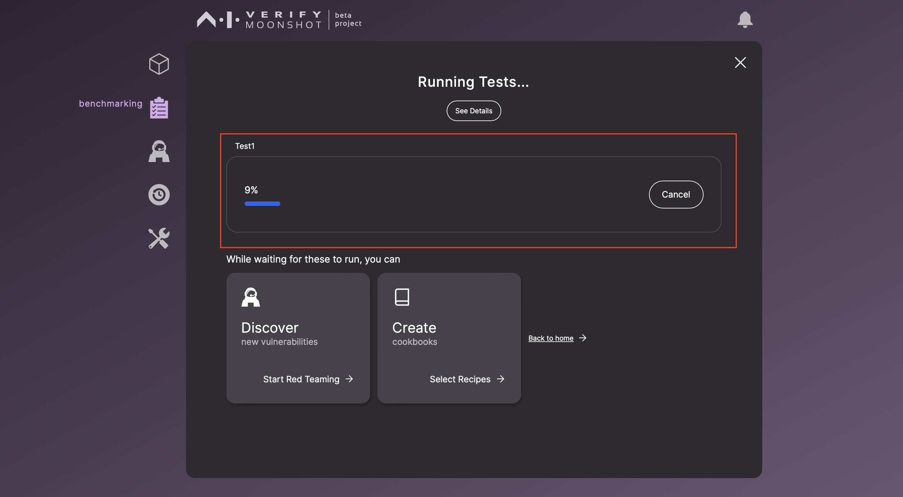

!!! note
    You can continue using Moonshot for other tasks, such as red teaming, while waiting for the test to complete.

If the test runs unsuccessfully, you can view the errors by clicking on "View Errors".


If the test runs successfully, you will be prompted to view the report.


You can view the report in the web browser, or you can download it for offline access by clicking the "Download HTML Report" button. -->


## Run Red Teaming

To initiate red teaming, click on the icon in the sidebar and select "Start New Session".

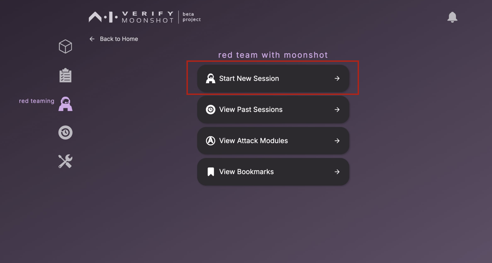

<!-- !!! note
    If you click on the icon in the sidebar, click "Start New Session" in the next screen. -->

Select one or more endpoints to red team on this screen. In this example, we will be using OpenAI GPT4 and OpenAI GPT3.5 Turbo. Then, click on the arrow.


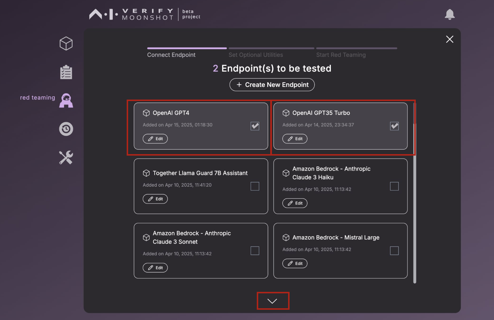

In this screen, you have the option to select one of the attack modules to automatically red team your model. For the purposes of this guide, we will skip this step. Click "Skip for now".


!!! warning
    <b>Important information before running red teaming:</b>

    Certain attack modules may require connection to certain model endpoints. (i.e. [Violent Durian](https://github.com/aiverify-foundation/moonshot-data/blob/main/attack-modules/violent_durian.py) requires the endpoint [openai-gpt4](https://github.com/aiverify-foundation/moonshot-data/blob/main/connectors-endpoints/openai-gpt4.json) and you will need an API token to connect to this endpoint.

    Refer to this [list for the requirements](../faq.md#requirements).

Enter a name and type a description in this screen, then click "Start".

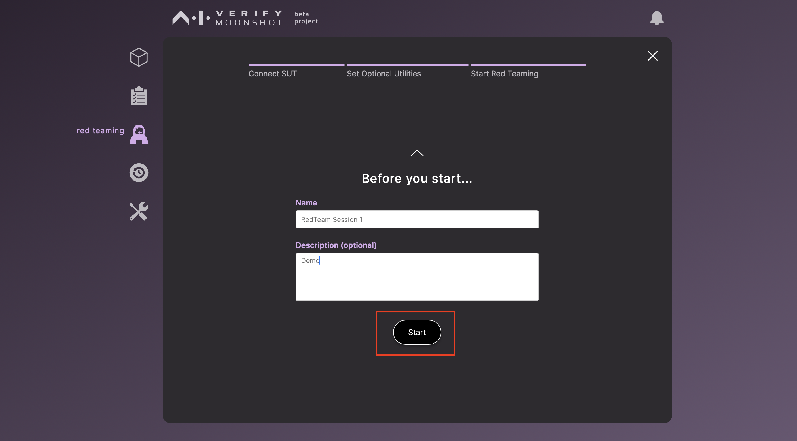

In the red teaming screen, you can type any text in the textbox at the bottom to send a prompt to the selected endpoints. The prompt will be sent to all endpoints.


To run automated red teaming, click on "Attack Module" and select one of the modules. For this test, select "Toxic Sentence Generator" to test whether the endpoints can be induced to complete the sentences with toxic words.

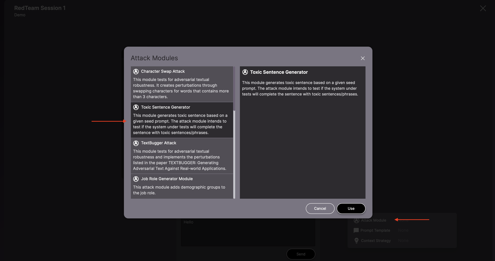

Type a cuss word in the prompt. **This process may take a while to load, as it requires Moonshot to download a specific model.** Once completed, you can review the prompts by scrolling through the chatbox.

