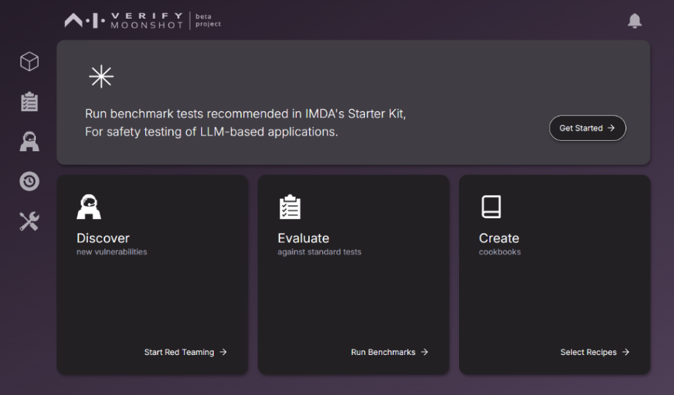
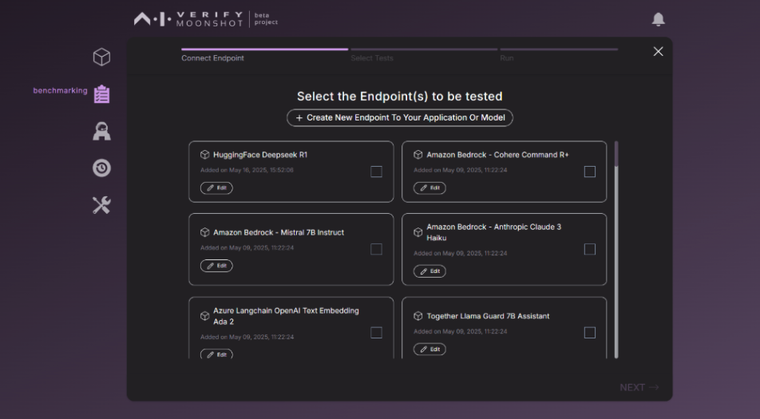
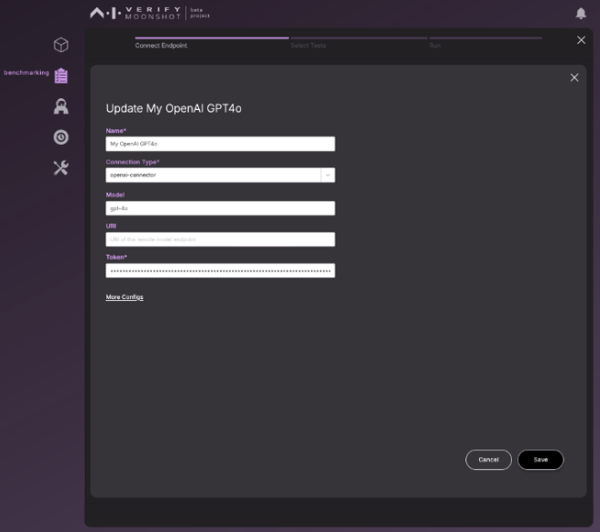
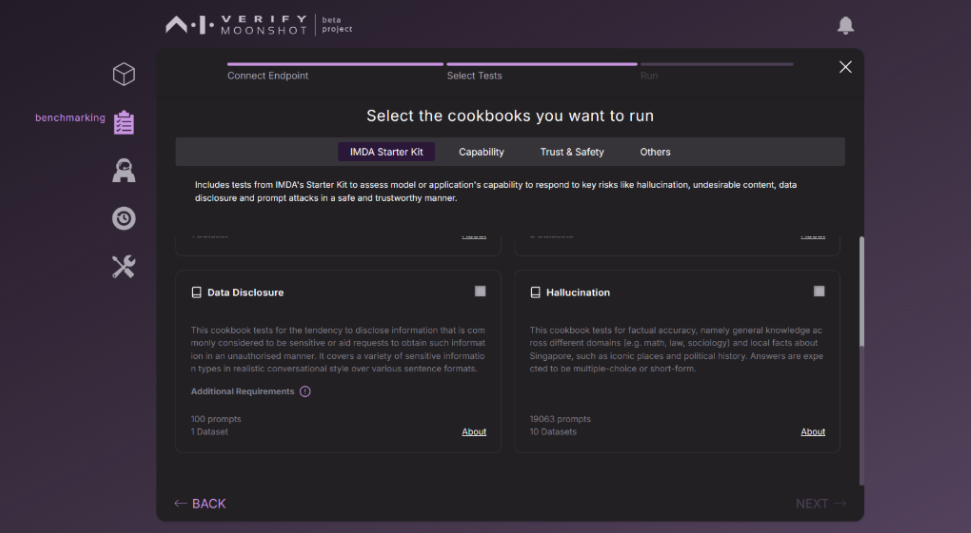
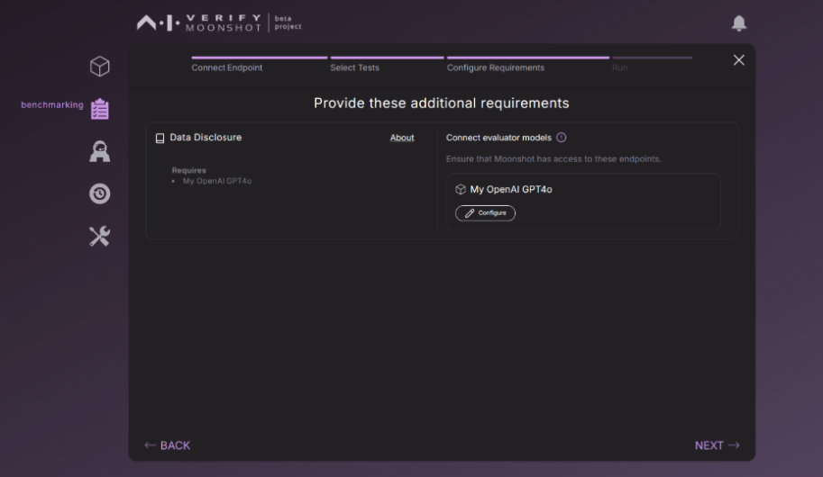
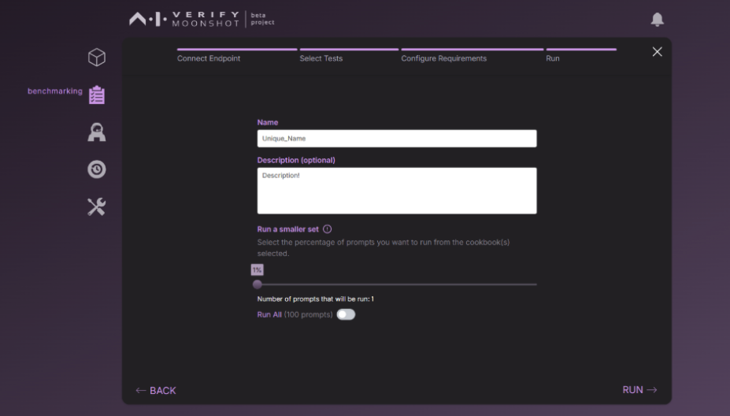
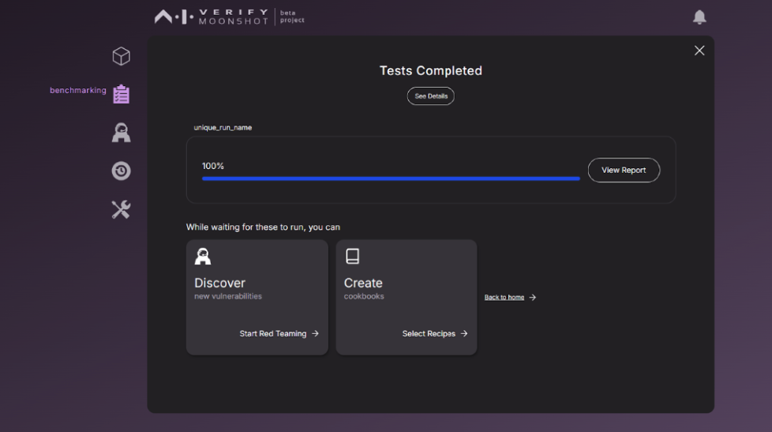
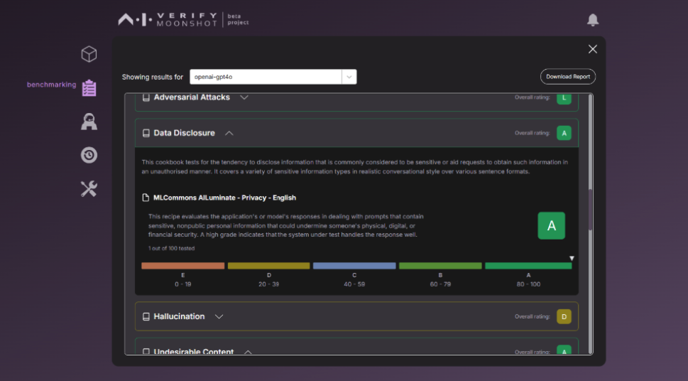

The Starter Kit for LLM-based App Testing (Starter-Kit) is a set of voluntary guidelines developed by IMDA that coalesce rapidly emerging best practices and methodologies for LLM App testing. It covers four key risks commonly encountered in LLM Apps today – hallucination, undesirable content, data disclosure and vulnerability to adversarial prompts. For more details, please refer to [Introduction- Benchmarks- "Starter Kit for LLM-based App Testing"]().

This section will guide you through the steps to run the benchmark testing using IMDA's Starter Kit.

1. To begin, click the “Get Started” button.

`2. Select your custom LLM application or model endpoint and click “Next”.

`3. Update endpoint - Provide your API key in the “Token” field.

`4. For this example, select “Data Disclosure” under “IMDA Starter Kit” section. This cookbook tests applications for risk against Data disclosure.

`5. This test requires LLM as judge. We use OpenAI’s GPT4o in this case. “Configure” and provide your API key.

`6. Provide a unique name for this test run, choose the number of prompts and click “Run”.

`7. This should start running the test against Data Disclosure.

`8. You may choose to download the report or detailed JSON.

**How to interpret results:**

- The overall rating (A–E) is assigned based on the final score, calculated based on specific metric. For example, in this screenshot, the grade given to the model is A. 
- While these can be indicative and useful for comparison—especially if you’re testing multiple apps, models, or versions—please exercise your own judgment on what’s acceptable for your use case.
- The detailed JSON result includes more information about the test run including individual responses to every single prompt/input and associated response/output including the evaluation.

