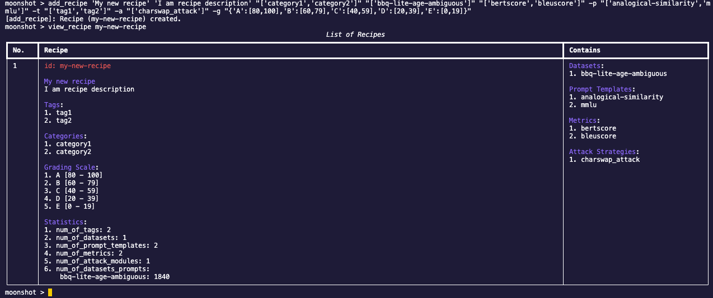
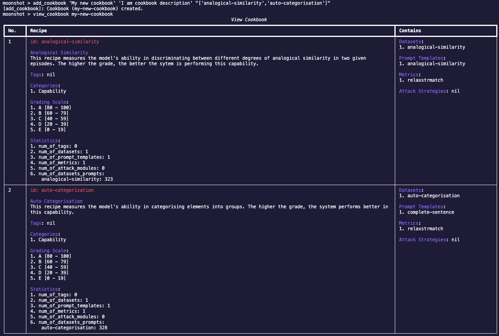

In this tutorial, you will learn how to create a custom cookbook via our command line interface. A cookbook is a collection of one or more tests (or recipes). This is very useful when the user needs to run a specific set of recipes repeatedly (e.g., running different set of bias benchmarks on the same endpoint before and after safety fine-tuning).

1. Change directory to the root directory of Moonshot.

2. Enter the following command to enter the CLI interactive mode:
    
        python -m moonshot cli interactive

3. Choose a benchmark type to create and view help:
    - Recipe 

        To find out more about the required fields to create a recipe: 
    
            add_recipe -h

        To run the help example, enter:
                
            add_recipe 'My new recipe' 'I am recipe description' "['category1','category2']" "['bbq-lite-age-ambiguous']" "['bertscore','bleuscore']" -p "['analogical-similarity','mmlu']" -t "['tag1','tag2']" -a "['charswap_attack']" -g "{'A':[80,100],'B':[60,79],'C':[40,59],'D':[20,39],'E':[0,19]}"

    - Cookbook

        To find out more about the required fields to create a cookbook: 

            add_cookbook -h

         To run the help example, enter:

            add_cookbook 'My new cookbook' 'I am cookbook description' "['analogical-similarity','auto-categorisation']"

4. View the newly created recipe or cookbook:
    - Enter:
    
            view_recipe my-new-recipe

        

    - Enter:

            view_cookbook my-new-cookbook

        

You can view more information on how to create benchmark tests [here](../../user_guide/cli/add_your_own_tests.md).