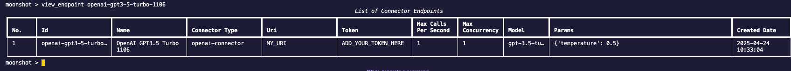

In this tutorial, you will learn how to configure and seamlessly connect Moonshot to your AI systems. A connector endpoint is a set of configuration that tells Moonshot how to connect to your AI model.

1. Change directory to the root directory of Moonshot. 

2. Enter the following command to enter the CLI interactive mode:
    
        python -m moonshot cli interactive

3. To find out more about the required fields to create a connector endpoint:

        add_endpoint -h

    To run the help example, enter:

        add_endpoint openai-connector 'OpenAI GPT3.5 Turbo 1106' MY_URI ADD_YOUR_TOKEN_HERE 1 1 "{'temperature': 0.5, 'model': 'gpt-3.5-turbo-1106'}"

4. View the newly created connector endpoint by entering:
     
        view_endpoint openai-gpt3-5-turbo-1106

> **_INFO:_**  `openai-gpt3-5-turbo-1106` is the ID of the connector endpoint and is slugified from the name `OpenAI GPT3.5 Turbo 1106`)

You can view more information on creating connector endpoint [here](../../user_guide/cli/connecting_endpoints.md).
