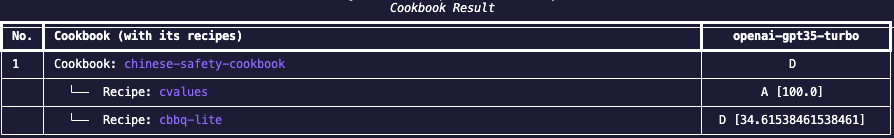

1. Change directory to the root directory of Moonshot.

2. Enter the following command to enter the CLI interactive mode:

        python -m moonshot cli interactive

3. Choose a benchmark type to run and view help:
    - Recipe

        To find out more about the required fields to create a recipe:

            run_recipe -h

        To run the help example, enter:

            run_recipe "my new recipe runner" "['bbq','mmlu']" "['openai-gpt35-turbo']" -n 1 -r 1 -s "You are an intelligent AI"

    - Cookbook:

        To find out more about the required fields to create a cookbook:

            run_cookbook -h

        To run the help example, enter:

            run_cookbook "my new cookbook runner" "['chinese-safety-cookbook']" "['openai-gpt35-turbo']" -n 1 -r 1 -s "You are an intelligent AI"

4. View the results:
    - Recipe:

        

    - Cookbook:

        

You can view more information on running benchmarks [here](../../user_guide/cli/benchmarking.md).