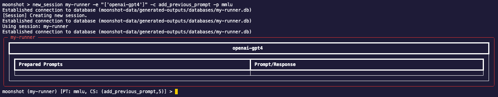
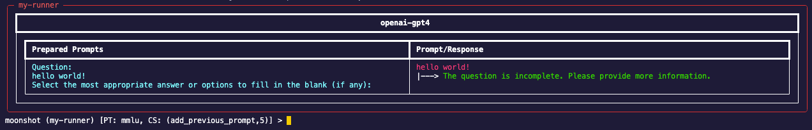
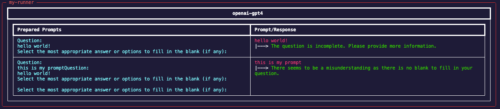

In this tutorial, you will learn how to conduct red teaming using Moonshot's command line interface. Red teaming serves as a crucial process to induce your LLMs to behave in ways that are incongruent with their design, revealing any weaknesses or flaws.

1. Change directory to the root directory of Moonshot.

2. Enter the following command to enter the CLI interactive mode:

        python -m moonshot cli interactive

3. Create a new session with a new runner:
    -  New Session

        To find out more about the required fields to create a new session:

            new_session -h

        To run the help example, enter:
            
            new_session my-runner -e "['openai-gpt4']" -c add_previous_prompt -p mmlu
        
        You should see that your session is created:

        

### Manual Red Teaming

Continuing from Step 3, you can type a prompt and it will be sent to the LLM:

### Automated Red Teaming

Continuing from Step 3 or manual red teaming, you can choose to run an attack module to perform automated red teaming. 

!!! warning
    <b>Important information before running red teaming:</b>

    Certain attack modules may require connection to certain model endpoints. (i.e. [Violent Durian](https://github.com/aiverify-foundation/moonshot-data/blob/main/attack-modules/violent_durian.py) requires the endpoint [openai-gpt4](https://github.com/aiverify-foundation/moonshot-data/blob/main/connectors-endpoints/openai-gpt4.json) and you will need an API token to connect to this endpoint.

    Refer to this [list for the requirements](../../faq.md#requirements).

- To find out more about the required fields to run an attack module:
        
        run_attack_module -h

    To run the help example, enter:

        run_attack_module sample_attack_module "this is my prompt" -s "test system prompt" -c "add_previous_prompt" -p "mmlu" -m "bleuscore"
    
    You should see your prompt and response:
    

You can view more information on running red teaming [here](../../user_guide/cli/red_teaming.md).    

