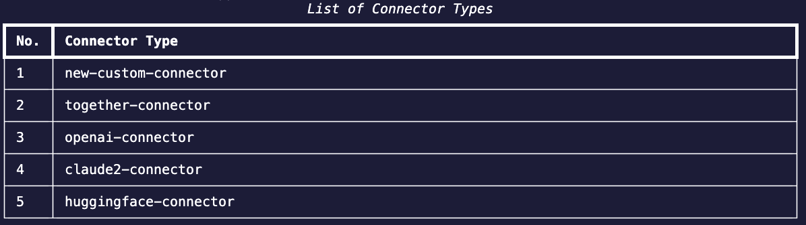

Currently, the most straightforward way is to duplicate an existing connector module, and modify the codes. This feature is currently not available on the Web UI and CLI.

All connectors inherit the super class [Connector](https://github.com/aiverify-foundation/moonshot/blob/main/moonshot/src/connectors/connector.py). We initalise this super class with certain variables that are common across various connectors (i.e. `token`, `max_concurrency`, etc). These variables come from another class called [ConnectorEndpoint](https://github.com/aiverify-foundation/moonshot/blob/main/moonshot/src/connectors_endpoints/connector_endpoint.py).

## Initialise Connector Class

We will use a set of modified code from one of our connectors [openai-connector](https://github.com/aiverify-foundation/moonshot-data/blob/main/connectors/openai-connector.py) as an example:


```
def __init__(self, ep_arguments: ConnectorEndpointArguments):
    # Initialize super class
    super().__init__(ep_arguments)

    # This is optional. You can keep this here if your model needs to take in a model field from the user
    self.model = self.optional_params.get("model", "")
```

The `__init__()` function initialises the Connector class. This must be included in your code.

```
@Connector.rate_limited # Limits the number of calls per second made to the LLM based on a variable max_calls_per_second. 
@perform_retry # Performs retries based on a variable num_of_retries. Throws a ConnectionError when the number of retries is hit. 
async def get_response(self, prompt: str) -> str:
    """
    Copy and paste this function and insert your codes to send prompts and receive responses from the target LLM 
    here. 

    Args:
        prompt (str): The input prompt to send to the target LLM.

    Returns:
        str: The text response generated by the target LLM.
    """
    # You may want to insert codes to perform appending or editing of prompt before sending to LLM
    connector_prompt = f"{self.pre_prompt}{prompt}{self.post_prompt}" # just an example
    
    # Every LLM requires their connector to send the prompts in a specific way with certain configurations
    response = await self._client.chat.completions.create(**new_params) # an example from the OpenAI Connector

    # Return the response of the LLM 
    return await self._process_response(response) # an example
```

## Modify Response Method

The `get_response()` is an abstract method that must be instantiated. This is where you will insert your code to send prompts to the LLM and receive responses.

```
async def _process_response(self, response: Any) -> str:
    """
    An optional helper method we have in all our connector types to process the response from the LLM. The way to
    process responses from different LLMs can be different. You can insert codes to process the response here if 
    you want.

    Args:
        response (Any): The response from the LLM. It depends on what the LLM returns as a response
        (i.e. could be a dict, string, list, etc)

    Returns:
        str: The processed response
    """
    return str(response) # an example
```
The `_process_response()` is an optional method that is included in all our connectors to aid in formatting responses from the LLM.

## List Your Newly Created Connector

Once you have your connector created, move it to your own `moonshot-data/connectors` folder. The name of your connector will be your file name (i.e. the name of your connector will be `new-custom-connector` if your connector file name is `new-custom-connector.py`)

If you are using CLI, you should be able to see your connector when you list the connectors using the following command:

```
moonshot > list_connector_types
```



## What's Next

Once you are able to see your newly created connector, you can proceed to create a connector endpoint (i.e. configuration file) :

- [Create Connector Endpoint via Web UI](../../tutorial/web-ui/create_endpoint.md)
- [Create Connector Endpoint via CLI](../../user_guide/cli/connecting_endpoints.md#creating-a-connector-endpoint)