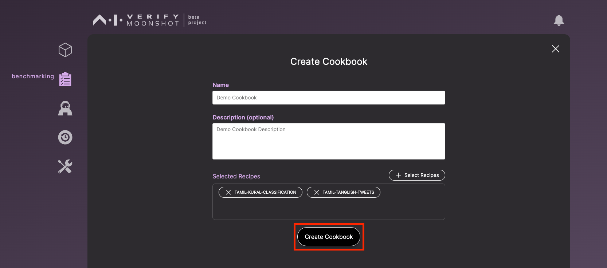
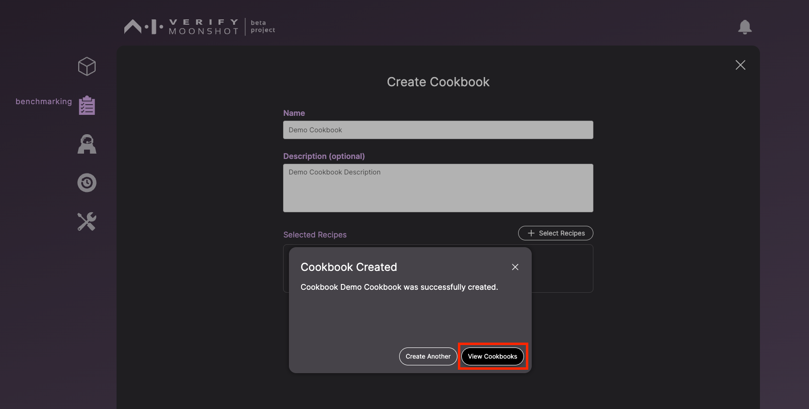

## Web UI

1. Click on 'Create Cookbooks, Select Recipes'.

2. Provide the following details and click 'Select Recipes'.

3. Here you can view the list of recipes available in Moonshot. Select the recipes that you would like to include in your custom cookbook and click on ‘Add to Cookbook’. 

4. Click on ‘Create Cookbook'.

5. After creating, you can click on 'View Cookbooks' to view all the cookbooks that you now have in the tool. 

