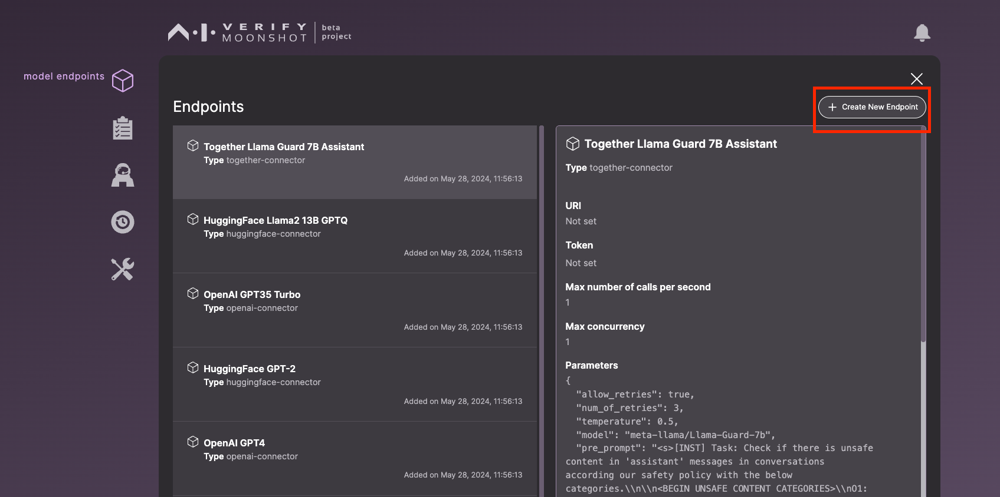
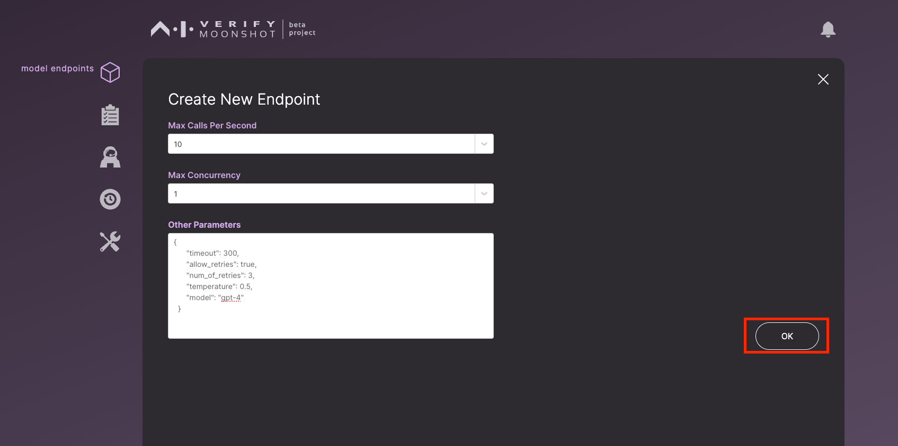

## Web UI

1. Click on the first icon on the side bar.

2. Click 'Create New Endpoint'. 

3. Fill in the following form and click "More Configs" for additional parameters.

4. Once you are done with the additional parameters. Click 'OK'

5. Click 'Save' to create your endpoint.

