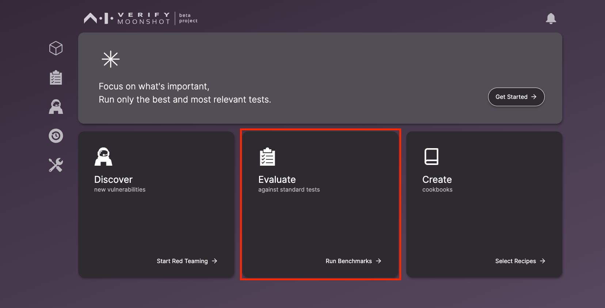
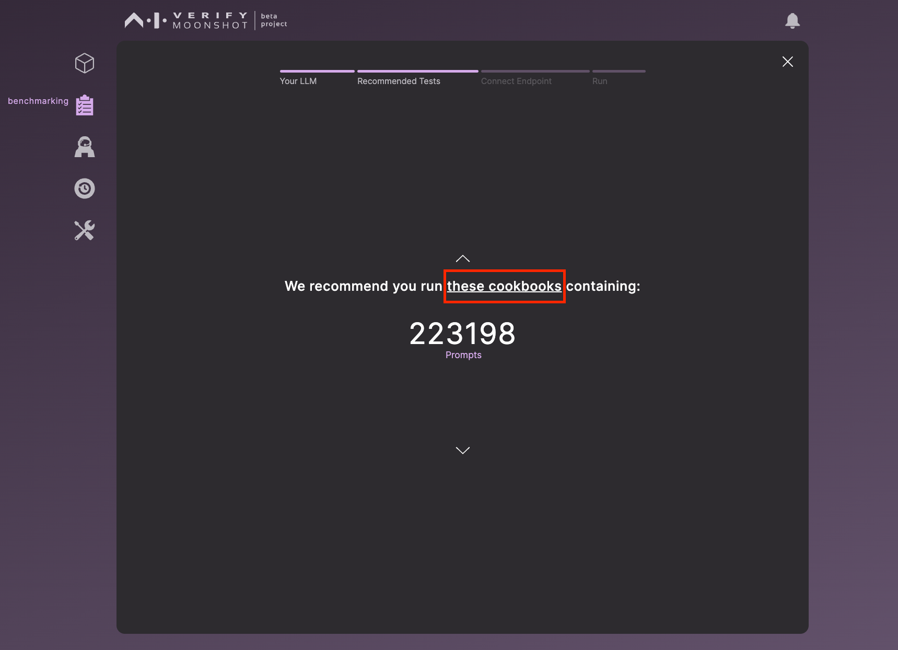
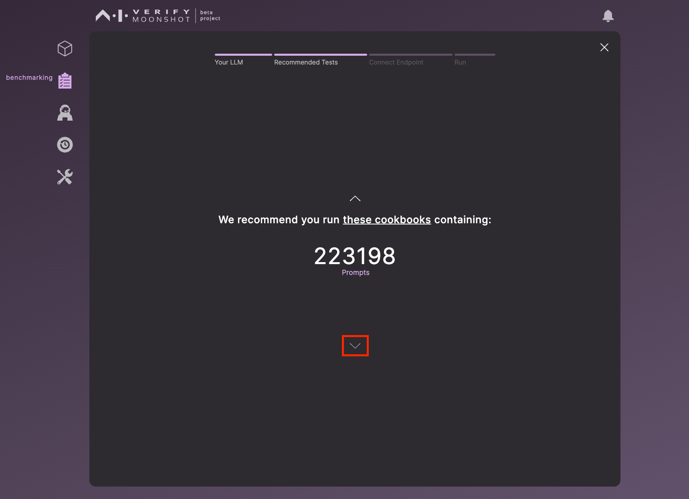
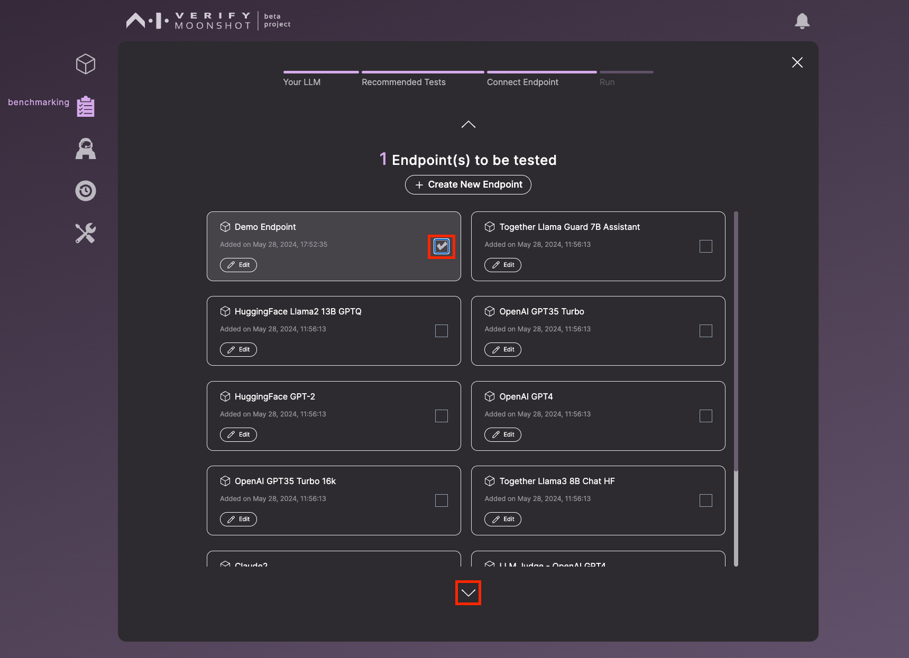
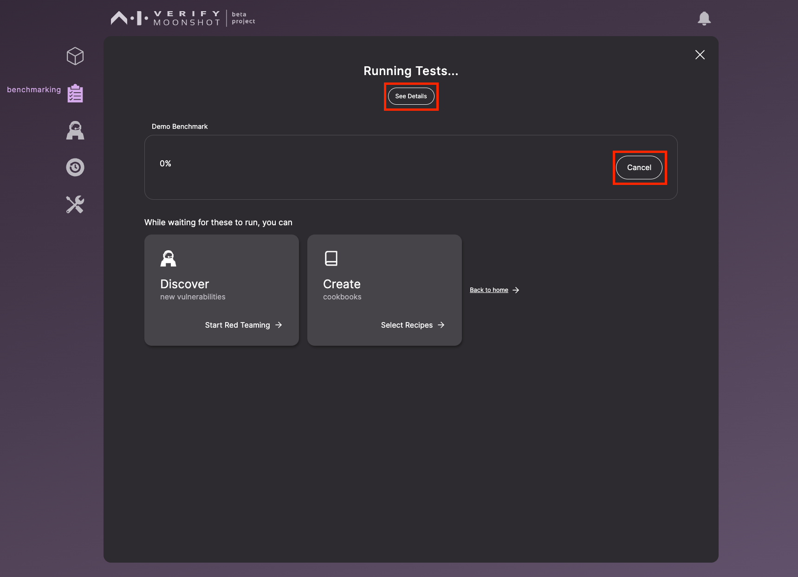

In this tutorial, you will learn how to run a benchmark in Moonshot. Benchmarks are a set of "exam questions" that can help to evaluate and assess the capabilities and safety of the AI system.

!!! note
    Moonshot offers a wide range of benchmarks, including widely recognized ones like Google's BigBench and HuggingFace's leaderboards, as well as more domain/task-specific tests like Tamil Language and Medical LLM benchmarks.

This tutorial will provide a step-by-step guide on how to run these benchmark tests, enabling you to measure your LLM application's performance in the categories of Capability, Quality, and Trust & Safety. 

Let's get started on running your first benchmark test.

In the homepage, click on "Evaluate against standard tests". Alternatively, you can click on "Get Started".

A set of recommended baseline cookbooks has been pre-selected. Select or deselect any cookbook that you wish to run. Once you've made your selection, click the down arrow button to proceed to the next step.

The total number of prompts in the cookbooks selected is displayed. Later on, you can specify the number of prompts per dataset that will be executed. Click on "these cookbooks" to view all the available cookbooks.

This page shows a list of cookbooks that are sorted by their category. To select a cookbook, click on the corresponding checkbox. For more information about a cookbook, click on "About". Once you've finished, click "OK".

You will be redirected back to the page showing the total number of prompts. To proceed to the next step, click the down arrow button.

Here, you are required to select an endpoint for testing. If needed, you can create a new endpoint or edit an existing one on this page. After selecting an endpoint, click on the down arrow button to proceed to the next step.

!!! warning
    <b>Important information before running your benchmark:</b>

    Before proceeding, please ensure that you have your [together-llama-guard-7b-assistant endpoint](https://github.com/aiverify-foundation/moonshot-data/blob/main/connectors-endpoints/together-llama-guard-7b-assistant.json) endpoint token set up. This is necessary to run one of our baseline cookbooks, MLCommon's AI Safety Benchmark.

    Refer to this [list for the requirements](../../faq.md#requirements).

On this page, you need to fill out the form. **Note that the benchmark run names should be unique. We use benchmark names to uniquely identify benchmark runs.** If you wish to test a smaller dataset, replace the value in the "Run a smaller set" field. By default, the value is 0, which means the entire cookbook will be run. By entering a value, you can specify the number of prompts to be tested from each dataset, as specified in the recipe. Once you've completed the form, click on "Run" to start the test.

The benchmark test is now running. You can click on "See Details" to view the endpoints and cookbooks that are currently running. If you wish to exit an ongoing run, click on "Cancel".

You can safely close the window while the benchmark is running; it will continue to operate in the background. To check the status of your run, click on the bell icon. If you wish to view more details about the run, simply click on the run itself.

After the benchmark test has finished, you can access the results by clicking on "View Report".

