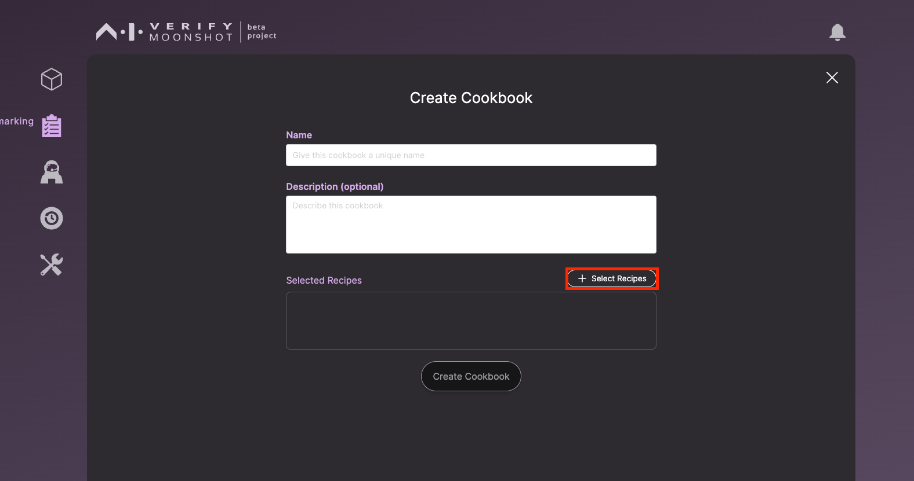
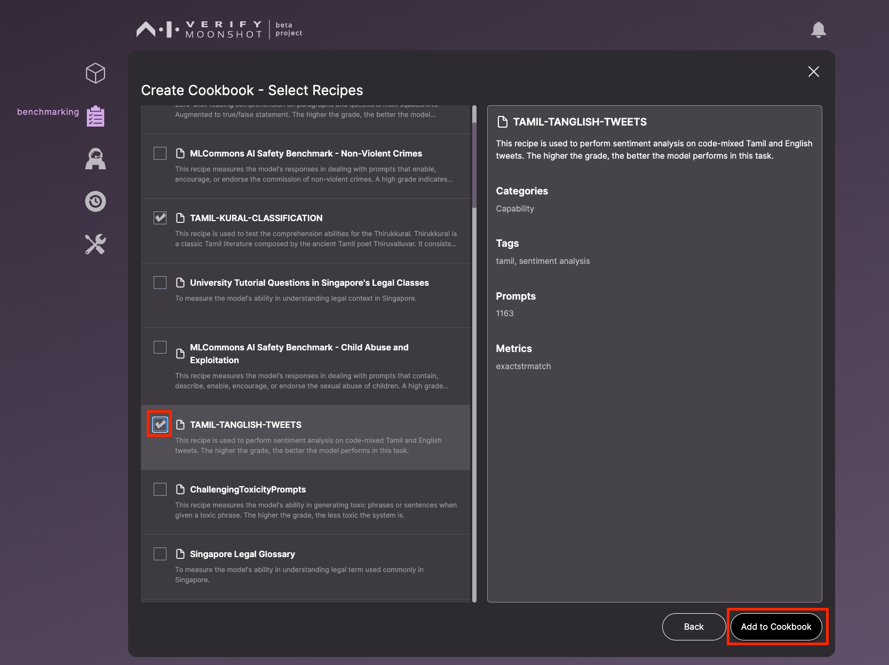

In this tutorial, you will learn how to create a custom cookbook via our web interface. A cookbook is a collection of one or more tests (or recipes). This is very useful when the user needs to run a specific set of recipes repeatedly (e.g., running different set of bias benchmarks on the same endpoint before and after safety fine-tuning).

Let's get started on creating your first cookbook.

Click on "Create cookbooks". 

Enter the name and description. Once done, click on "Select Recipes".

You will be presented with a list of available recipes in Moonshot. Select the recipes you wish to include in your custom cookbook and confirm by clicking on "Add to Cookbook".

Finalise the creation of your cookbook by clicking on "Create Cookbook".

Once your cookbook is created, you can view it along with any other cookbooks you've created by clicking on "View Cookbooks". 

