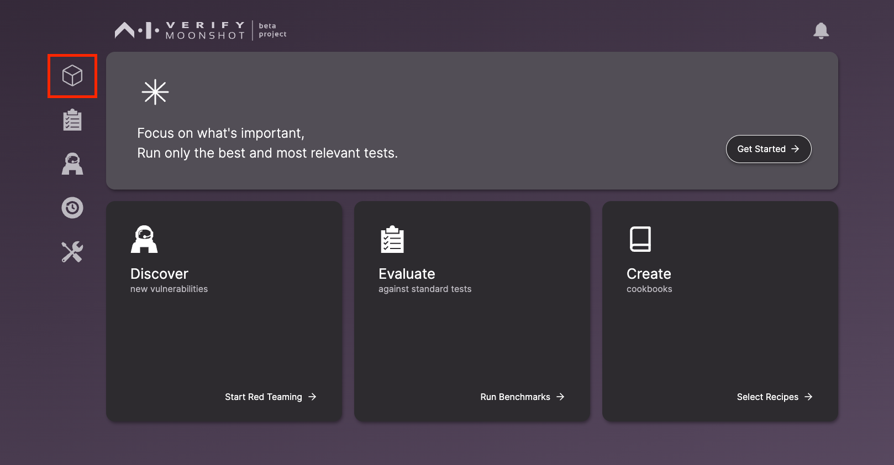
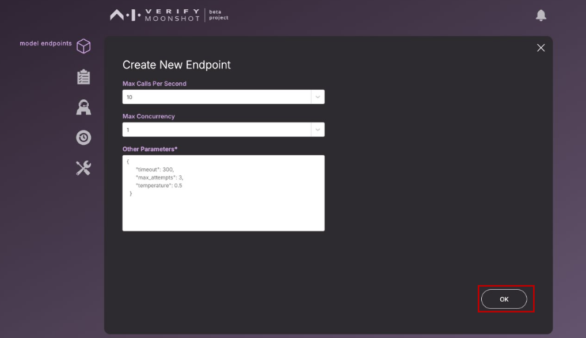
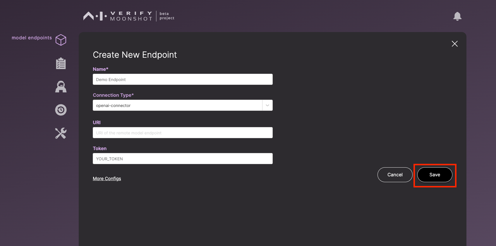

In this tutorial, you will learn how to configure and seamlessly connect Moonshot to your AI systems. A connector endpoint is a set of configurations that tells Moonshot how to connect to your AI model.

Let's dive in and start connecting your models.

Click on the "model endpoints" icon in the sidebar panel.

Click on "Create New Endpoint" to create a new endpoint.

A form will appear. Enter the details. If your AI models require more details, click on "More Configs" to add/amend the additional parameters.

!!! note

    You can add in additional parameters that are required by your model. An example is *top_k*.

Click "OK" to confirm your details.

Click "Save" to save your configuration.

