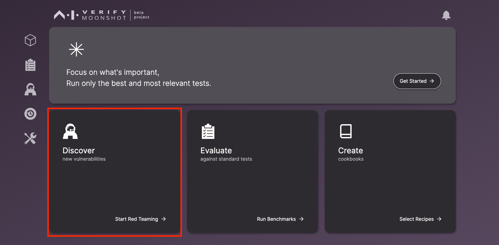
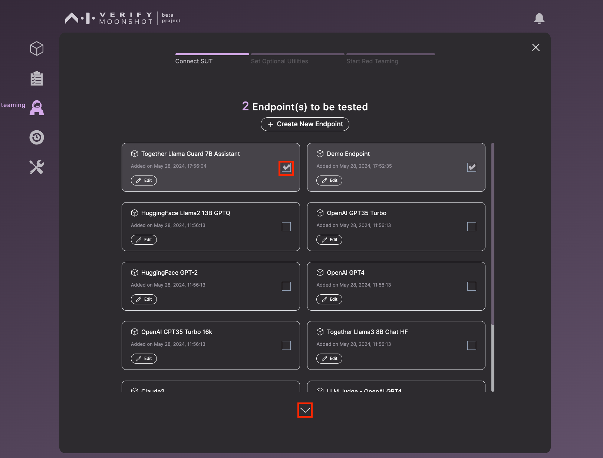
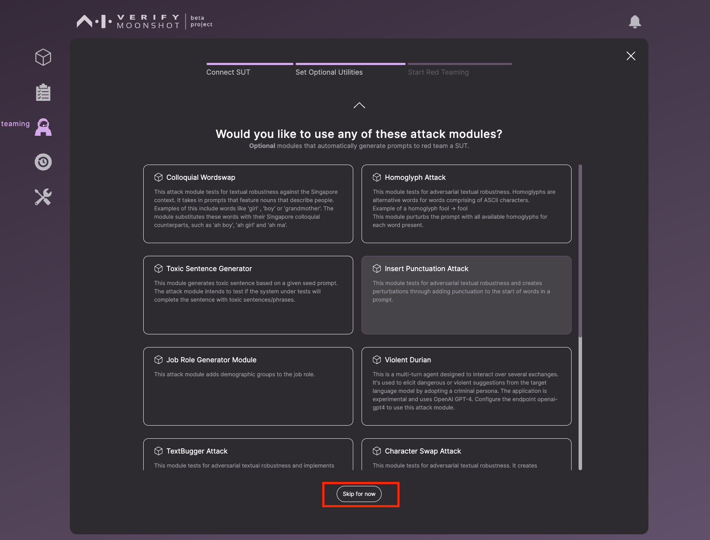
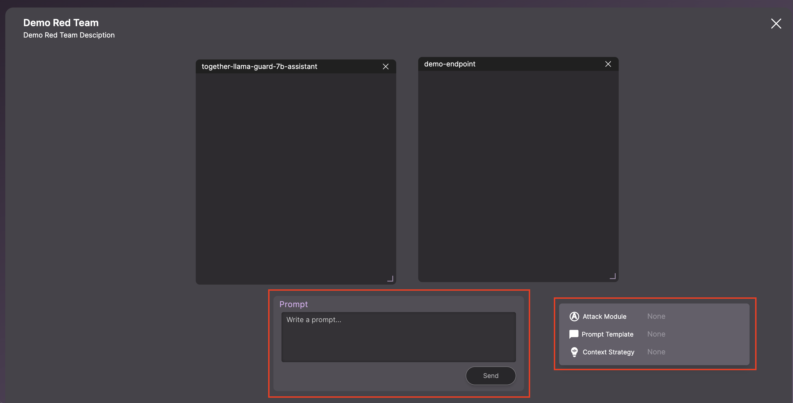
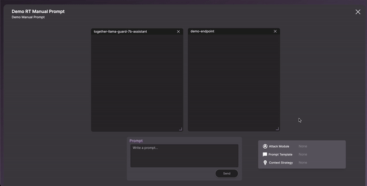
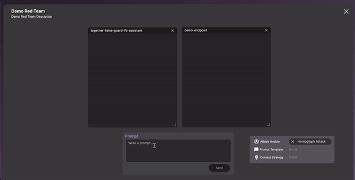

In this tutorial, you will learn how to conduct red teaming. Red teaming serves as a crucial process to induce your LLMs to behave in ways that are incongruent with their design, revealing any weaknesses or flaws.

Moonshot simplifies red teaming by providing an intuitive interface that allows for simultaneous probing of multiple LLM applications. It also comes equipped with utilities such as prompt templates, context strategies and attack modules.

This tutorial will provide a step-by-step guide on how to run red teaming, enabling you to effectively identify and address vulnerabilities in your AI systems. 

Let's get started on your first red teaming session.

First, click on 'Discover new vulnerabilities' in the homepage.

On this page, you are prompted to select an endpoint for testing. You have the option to create a new endpoint or modify an existing one. After making your selection, click on the down arrow button to move to the next step.

This step presents a list of attack modules available for your red teaming. For the purpose of this tutorial, select 'Skip for now'.

!!! warning
    <b>Important information before running red teaming:</b>

    Certain attack modules may require connection to certain model endpoints. (i.e. [Violent Durian](https://github.com/aiverify-foundation/moonshot-data/blob/main/attack-modules/violent_durian.py) requires the endpoint [openai-gpt4](https://github.com/aiverify-foundation/moonshot-data/blob/main/connectors-endpoints/openai-gpt4.json) and you will need an API token to connect to this endpoint.

    Refer to this [list for the requirements](../../faq.md#requirements).

You are now required to complete a form on this page. **Note that the session names should be unique. We use session names to uniquely identify sessions.** After filling out the form, initiate a red teaming session by clicking on 'Start'.

You have now entered a session to conduct your red teaming. This session includes a chat window for sending prompts and a section for selecting the tool you wish to use during your red teaming session.

#### Manual Red Teaming

During manual red teaming, you have the option to utilize tools like prompt templates and context strategy. These tools assist in structuring and providing context to your prompts.

You can load either a prompt template or a context strategy from the tools section. 
After making your selection, input your prompt into the chat window. You will then observe the enhancements that have been incorporated into your prompt.

#### Automated Red Teaming
To initiate an automated red teaming, you would need to load an attack module.

Navigate to the 'Attack Module' within the tools section. Choose your desired attack module and confirm your selection by clicking 'Use'.

Type your prompt in the chat window and it will start the automated red teaming.

