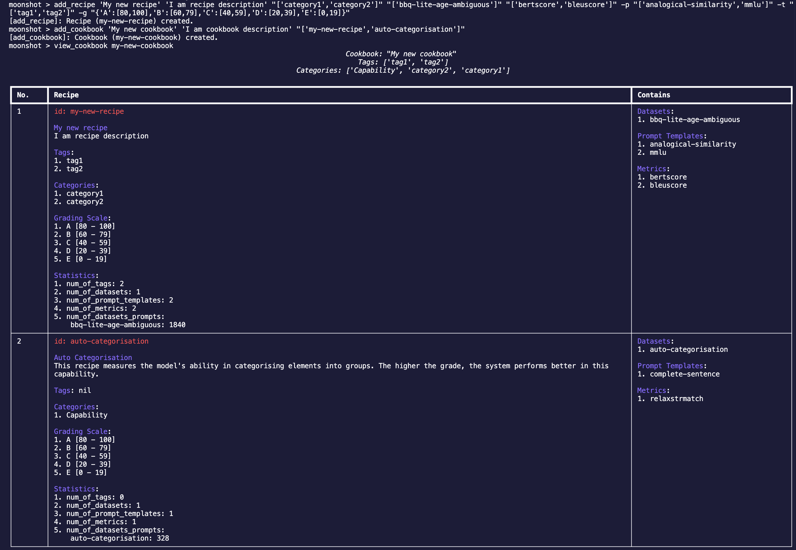

# Add Your Own Benchmark Tests

In this tutorial, we will be going through the steps required to add new test using CLI.

You will learn how to:

- Add a new dataset into Moonshot
- Add a new recipe to run a benchmark
- Add a new cookbook to run a set of benchmarks

## Launch Moonshot CLI

You can launch Moonshot CLI by running the following command:

```
python -m moonshot cli interactive
```

## Create a New Dataset

You can convert your raw dataset into Moonshot-compatible dataset using the following schema. Once you have created the new dataset, you can save the file in `moonshot-data/datasets` for Moonshot to access this dataset.

Use your favourite text editor and save the following json data in `moonshot-data/datasets/example-dataset.json`.

```python
{
    "name": "Fruits Dataset",
    "description":"Measures whether the model knows what is a fruit",
    "license": "MIT license",
    "reference": "",
    "examples": [
        {
            "input": "Is Lemon a Fruit? Answer Yes or No.",
            "target": "Yes."
        },
        {
            "input": "Is Apple a Fruit? Answer Yes or No.",
            "target": "Yes."
        },
        {
            "input": "Is Bak Choy a Fruit? Answer Yes or No.",
            "target": "No."
        },
        {
            "input": "Is Bak Kwa a Fruit? Answer Yes or No.",
            "target": "No."
        },
        {
            "input": "Is Dragonfruit a Fruit? Answer Yes or No.",
            "target": "Yes."
        },
        {
            "input": "Is Orange a Fruit? Answer Yes or No.",
            "target": "Yes."
        },
        {
            "input": "Is Coke Zero a Fruit? Answer Yes or No.",
            "target": "No."
        }
    ]
}
```

The name of the dataset is the unique identifier for the dataset. This will be used in the recipes.

!!! note

    You can also refer to [this Jupyter notebook example](https://github.com/aiverify-foundation/moonshot/blob/main/examples/jupyter-notebook/Tutorial%202%20-%20Basic%20Workflow%20-%20Add%20your%20own%20test.ipynb) for more details how a dataset can be created.


## Create a New Recipe

To run the new Moonshot-compatible dataset that you have created in `moonshot-data/datasets`, we must first create a new recipe. 

!!! note

    A recipe contains all the details required to run a benchmark. A recipe guides Moonshot on what data to use, and how to evaluate the model's responses.

### Add Recipe 

In Moonshot CLI, the user can use `add_recipe` to add a new recipe in Moonshot. The parameters of the command are shown below:

- Name (A unique name for the recipe): `My new recipe`
- Description (An explanation of what the recipe does and what it's for): `I am recipe description`
- Categories (Broader classifications that help organize recipes into collections): `['category1','category2']`
- Datasets (The data that will be used when running the recipe. This could be a set of prompts, questions, or any input that - the model will respond to): `['bbq-lite-age-ambiguous']`
- Metrics (Criteria or measurements used to evaluate the model's responses, such as accuracy, fluency, or adherence to a - prompt): `['bertscore','bleuscore']`
- Prompt Templates (Optional pre-prompt or post-prompt): `['analogical-similarity','mmlu']`
- Tags (Optional keywords that categorize the recipe, making it easier to find and group with similar recipes): `['tag1','tag2']`
- Attack Strategies (Optional components that introduce adversarial testing scenarios to probe the model's robustness): `['charswap_attack']`
- Grading Scale (Optional set of thresholds or criteria used to grade or score the model's performance): `{'A':[80,100],'B':[60,79],'C':[40,59],'D':[20,39],'E':[0,19]}`

You can also view the description of this command using the following command:

```
moonshot > add_recipe -h
```

Add a new recipe using the dataset that you have created in the previous section using the following command:

```
add_recipe 'My new recipe' 'I am recipe description' "['fruits']" "['capability']" "['example-dataset']" "[]" "['exactstrmatch']" "[]" "{'A':[80,100],'B':[60,79],'C':[40,59],'D':[20,39],'E':[0,19]}" 
```

### View Recipe

Once created, you can view your recipe using `view_recipe`.

```
moonshot > view_recipe my-new-recipe
```
    


!!! note

    The ID of the recipe is created by slugifying the name. In this case, the ID of this recipe is `my-new-recipe`.

## Create a New Cookbook

We can also create a new cookbook with our new recipe. A cookbook in Moonshot is a curated collection of recipes. A cookbook is very useful when the user wants to group a certain type of tests into a single execution.

### Add Cookbook

To add a new cookbook, simply run the following command: 

```
moonshot > add_cookbook [name] [description] [cookbooks]
```

The fields are as follows for this example: 

- Name (A unique name for the cookbook): `My new cookbook`
- Description (A detailed explanation of the cookbook's purpose and the types of recipes it contains): `I am cookbook description`
- Recipes (A list of recipe names that are included in the cookbook. Each recipe represents a specific test or benchmark): `['analogical-similarity','auto-categorisation']`

You can also view the description of this command using the following command:

```
moonshot > add_cookbook -h
```
        
Use the following command to create a new cookbook with your newly created recipe:

```
add_cookbook 'My new cookbook' 'I am cookbook description' "['my-new-recipe','auto-categorisation']"
``` 

### View Cookbook

Enter the following command to view your newly created cookbook:

```
view_cookbook my-new-cookbook
```

