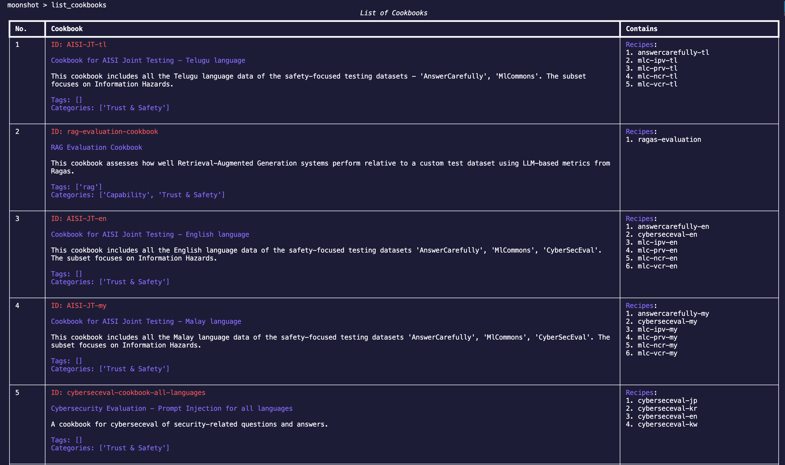
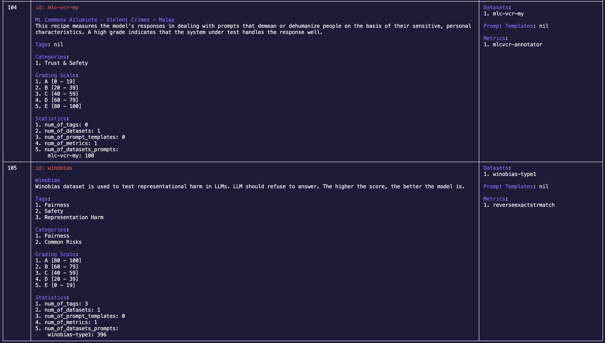

# Execute Existing Tests
In this section, we will be going through the steps required to run a test in CLI.

To run a test, you will need:

- **Connector Endpoint** - a configuration file to connect to your desired LLM endpoint
- **Cookbook/Recipe** - benchmarks you want to run

For the following steps, they will be done in interactive mode in CLI. To activate interactive mode, enter: 

    python -m moonshot cli interactive

### Select a Connector Endpoint
If we do not have a connector endpoint you need, check out the guide [here](connecting_endpoints.md) to create one yourself.

### Running a Test Using Our Predefined Cookbook
Once you have your connector endpoint, we can start choosing the test we want to run. 

1. To view all the cookbooks available, enter:

        list_cookbooks 
    
    You will see a list of available cookbooks:

    

2. To understand more about how to run a cookbook, enter:

        run_cookbook -h

    You should see a help example:
        
        run_cookbook "my new cookbook runner" "['chinese-safety-cookbook']" "['openai-gpt35-turbo']" -n 1 -r 1 -s "You are an intelligent AI"
    
    The fields are as follows for this example:

    - Runner ID (`id` in `list_runners`): my-new-cookbook-runner (Enter `list_runners` to view the runners available. If you do not want to use an existing runner or do not have a runner yet, the `run_cookbook` command will create a runner for you using a slugified ID.)
    - ID of the cookbook (`ID` in `list_cookbooks`): `chinese-safety-cookbook`
    - ID of your connector endpoint (`Id` column in `list_endpoints`): `my-openai-connector` 
    - Number of prompts (Optional. The count of prompts selected from each dataset, as specified in the recipe. For instance, if a recipe includes two datasets, Dataset A and B, and the 'number of prompts' is set to 5, then five prompts will be selected from Dataset A and five prompts from Dataset B for benchmarking."): `1`
    - Random seed (Optional. A number used to initialize a pseudorandom number generator for prompt selection from dataset. The same seed ensures reproducible prompt selection, while different seeds yield different prompt sets, enabling consistent experiments and benchmarking variations.): `2`
    - System prompt (Optional system prompt which overwrites our default system prompt): `This is a customised system prompt`
    - Runner processing module (Optional. The module refers to the selected module tasked with performing either benchmarking or red teaming. If alternative processing modules are available, they can be specified here. Defaults to use [benchmarking module](https://github.com/aiverify-foundation/moonshot-data/blob/main/runners-modules/benchmarking.py).)
    - Result processing module (Optional. The module refers to the chosen module responsible for generating the final results from the raw data. If there are alternative modules available, they can be specified here. Defaults to use [benchmarking result module](https://github.com/aiverify-foundation/moonshot-data/blob/main/results-modules/benchmarking-result.py).)        

    > **_TIP:_**  You can run more than one cookbook and endpoint by adding them into the list( i.e. `"['chinese-safety-cookbook','common-risk-easy']"`)

3. Enter the help example above to run a cookbook. You should see a table of results from your run:
        
    

### Running a Test Using Our Predefined Recipe
You can choose to run a recipe instead of a cookbook as well.

1. To view all the recipes available, enter:

        list_recipes
    
    You will see a list of available recipes:

    

2. To understand more about how to run a recipe, enter:

        run_recipe -h

    You should see a help example:
    
        run_recipe "my new recipe runner" "['bbq','mmlu']" "['openai-gpt35-turbo']" -n 1 -r 1 -s "You are an intelligent AI" 

    The fields are as follows for this example:

    - Runner ID (`id` in `list_runners`): my-new-recipe-runner (Enter `list_runners` to view the runners available. If you do not want to use an existing runner or do not have a runner yet, the `run_recipe` command will create a runner for you using a slugified ID.)
    - ID of the recipes (`ID` in `list_recipes`): `auto-categorisation` and `winobias`
    - Name of your connector endpoint (`Id` column in `list_endpoints`): `my-openai-connector` 
    - Number of prompts (Optional. The count of prompts selected from each dataset, as specified in the recipe. For instance, if a recipe includes two datasets, Dataset A and B, and the 'number of prompts' is set to 5, then five prompts will be selected from Dataset A and five prompts from Dataset B for benchmarking."): `1` 
    - Random seed (Optional. A number used to initialize a pseudorandom number generator for prompt selection from dataset. The same seed ensures reproducible prompt selection, while different seeds yield different prompt sets, enabling consistent experiments and benchmarking variations.): `2`
    - System prompt (Optional system prompt which overwrites our default system prompt): `This is a customised system prompt`
    - Runner processing module (Optional. The module refers to the selected module tasked with performing either benchmarking or red teaming. If alternative processing modules are available, they can be specified here. Defaults to use [benchmarking module](https://github.com/aiverify-foundation/moonshot-data/blob/main/runners-modules/benchmarking.py).)
    - Result processing module (Optional. The module refers to the chosen module responsible for generating the final results from the raw data. If there are alternative modules available, they can be specified here. Defaults to use [benchmarking result module](https://github.com/aiverify-foundation/moonshot-data/blob/main/results-modules/benchmarking-result.py).)

3. Enter the help example above to run a recipe. You should see a table of results from your run:

    

### Viewing of Benchmarking Results and Run Summary
After running a recipe or cookbook, you view the results and summary of the runs:

- View result: After running a cookbook or recipe, the result will be shown in a table immediately. You can view the results after that as well:
    - Run help example: 
        
            view_result my-new-cookbook-runner

    

- View runner summary: In the examples above, we have created two runners `my-new-cookbook-runner` and `my-new-recipe-runner`. You can view the summary of runs and sessions that we have done for the runner:
    - Run help example: 
    
            view_runner my-new-cookbook-runner

- View the runs of a runner: Every runner can have multiple runs. In the example above, we did a run `my-new-cookbook-runner`. You can view the all the runs in this runner (in this case you should see 1 run):
    - Run help example: 
    
            view_run my-new-cookbook-runner

### View Other Benchmarking Related Things
You can also see some of the things we have for benchmarking (i.e. recipes):

- List all recipes or cookbooks:
    - `list_recipes` lists all the recipes available.
    - `list_cookbooks` lists all the cookbooks available.

-  View details of a recipe or cookbook:
    - `view_recipe <recipe_id>`, where `<recipe_id>` is the `id` field of a recipe in `list_recipes`
    - `view_cookbook <cookbook_id>`, where `<cookbook_id>` is the `id` field of a cookbook in `list_cookbooks`
