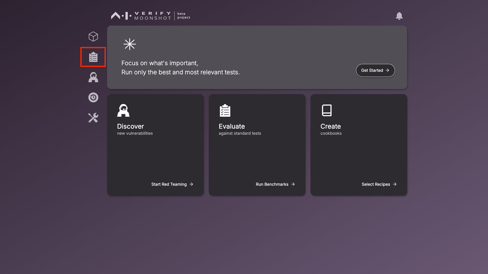
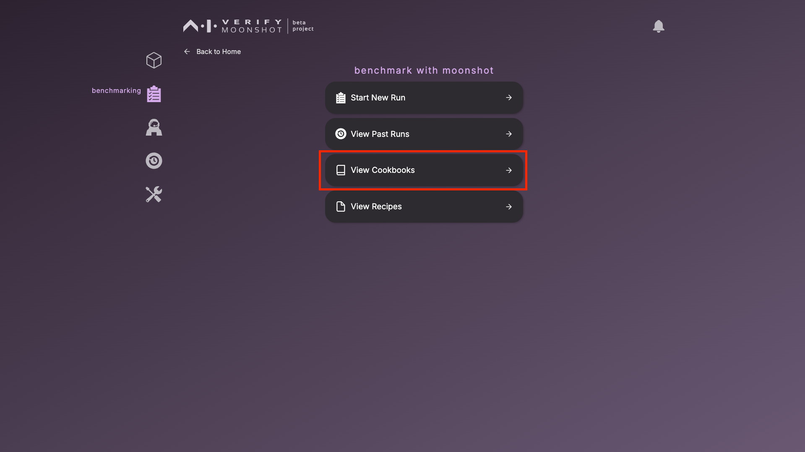
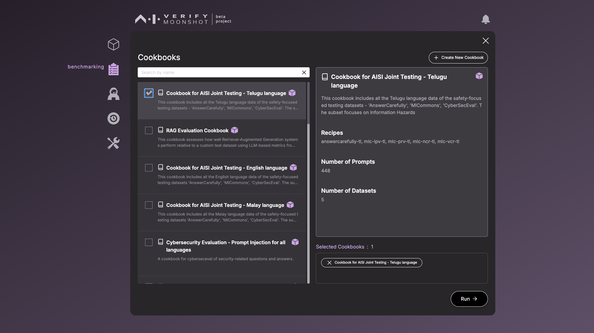
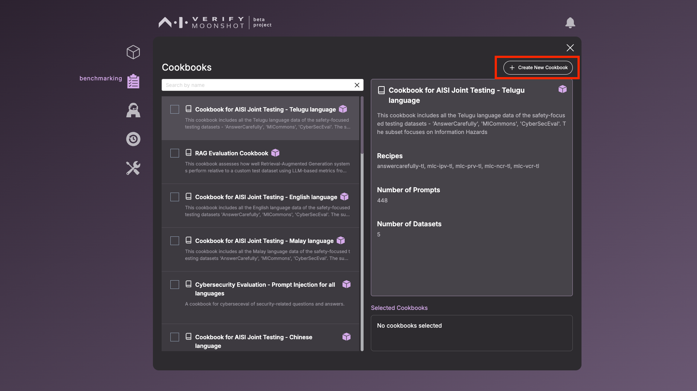
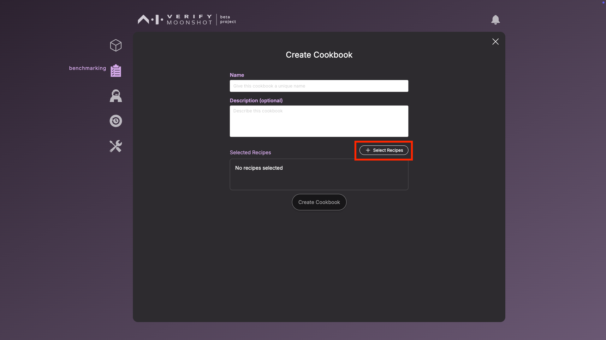
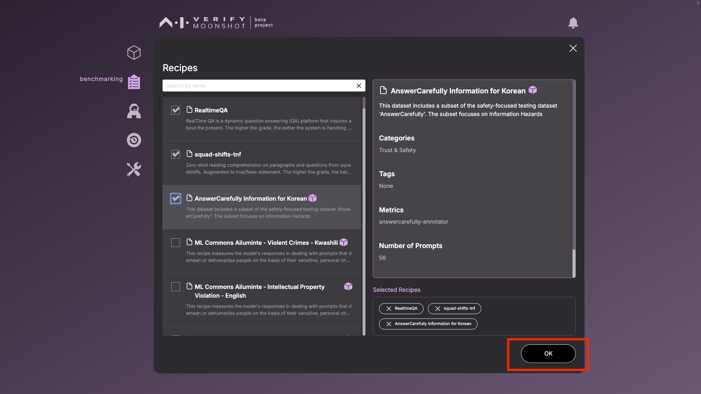

# Choosing Relevant Tests

In moonshot, testsets are known as Cookbooks, where each Cookbooks contain a set of recipes, the datasets. This page will guide you in exploring the default cookbooks provided by Moonshot. 

Each cookbook contains recipes of the same focus area. Select the cookbooks that are most relevant to your use case. You will also be able to curate custom cookbooks.

[View full list of cookbook details](../../resources/cookbooks.md) 

[Instructions to create a custom cookbook](./creating_custom_cookbooks.md) 

1. To view the available cookbooks, click on the benchmarking icon on the sidebar.

    

2. Click on "View Cookbooks" to show the list of available cookbooks.

     

3. The window will show the list of available cookbooks. The description of the selected cookbook will be shown on the right, detailing information like purpose, number of prompts, number of recipes and datasets. 

    !!! note 
        Observe that certain cookbooks have a purple box icon. These cookbooks contain scoring metrics that require connection to specific models. 

        MLCommons AI Safety Benchmarks v0.5 (Requires an API key for accessing Llama Guard via Together AI)

        Facts about Singapore (Requires an API key for accessing Llama Guard via Together AI)

        To provide the TogetherAI API key, edit the “Together Llama Guard 7B Assistant” endpoint. (Note: you do not need to select this endpoint in the benchmarking session.) If you would like to use an alternative Llama Guard 7B assistant, see the [FAQ](../../faq.md#requirements) on how to do so.

     

4. Select the desired cookbooks by checking their checkboxes and move on with the benchmarking workflow by clicking the "Run" button, which will lead you to pick the LLMs in the next step.
    
    [Continue with Benchmarking Test Run](./connecting_to_llms.md) 

---
**Extra: Creating your custom cookbook**

1. There is also a functionality to create your own Cookbook. Click on the button on the top right of the windoww

    

2. This will lead you to the window to define your custom cookbook name, description and selected recipes. Click on the "Select Recipes" button to add the desired recipes

    

3. Check the relevant recipes. These recipes will show up at the bottom right box. Click "Ok" to proceed. This cookbook will be saved and you can use it for your benchmarking run. 

    
