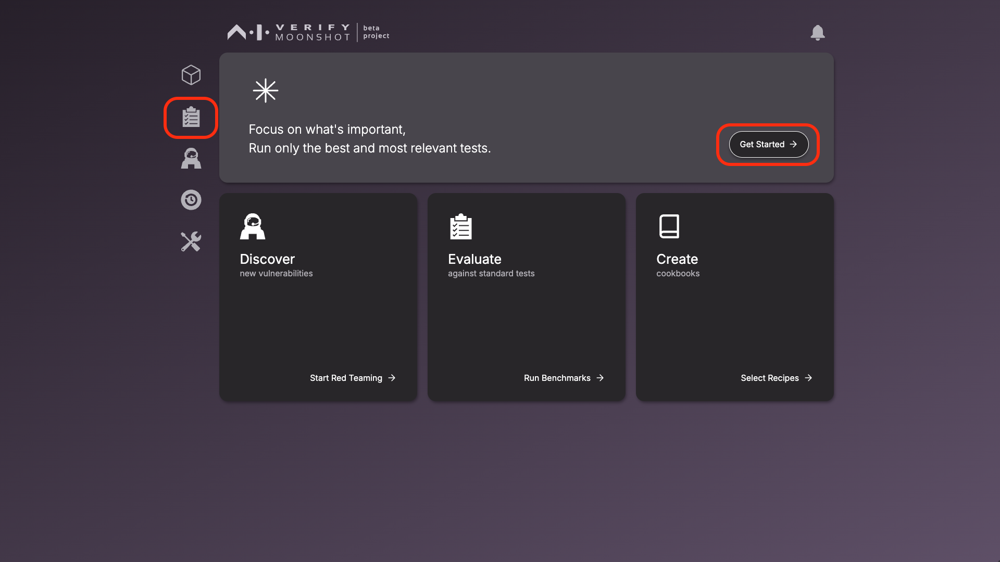
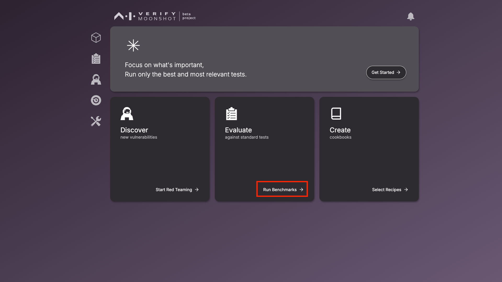

# Choosing Relevant Tests

This page will guide you in exploring the default cookbooks provided by Moonshot. Each cookbook contains tests of the same focus area. Select the cookbooks that are most relevant to your use case. You will also be able to curate custom cookbooks.

[View full list of cookbook details](../../resources/cookbooks.md) 

[Instructions to create a custom cookbook](./creating_custom_cookbooks.md) 

This is also the first step to starting a Benchmark run.

1. To view the available cookbooks, click on the benchmarking icon on the sidebar or the "Get Started" button.

    

2. If you clicked on the benchmarking icon, click on "View Cookbooks" to show the list of available cookbooks.

     

3. The window will show the list of available cookbooks. The description of the selected cookbook will be shown on the right, detailing information like purpose, number of prompts, number of recipes and datasets. 

    !!! note 
        Observe that certain cookbooks have a purple box icon. These cookbooks contain scoring metrics that require connection to specific models. 

        MLCommons AI Safety Benchmarks v0.5 (Requires an API key for accessing Llama Guard via Together AI)

        Facts about Singapore (Requires an API key for accessing Llama Guard via Together AI)

        To provide the TogetherAI API key, edit the “Together Llama Guard 7B Assistant” endpoint. (Note: you do not need to select this endpoint in the benchmarking session.) If you would like to use an alternative Llama Guard 7B assistant, see the [FAQ](../../faq.md#requirements) on how to do so.

     

4. Select the desired cookbooks by checking their checkboxes and move on with the benchmarking workflow by clicking the "Run" button, which will lead you to pick the LLMs next.

    [Click here to select the LLMs for benchmarking](./connecting_to_llms.md) 