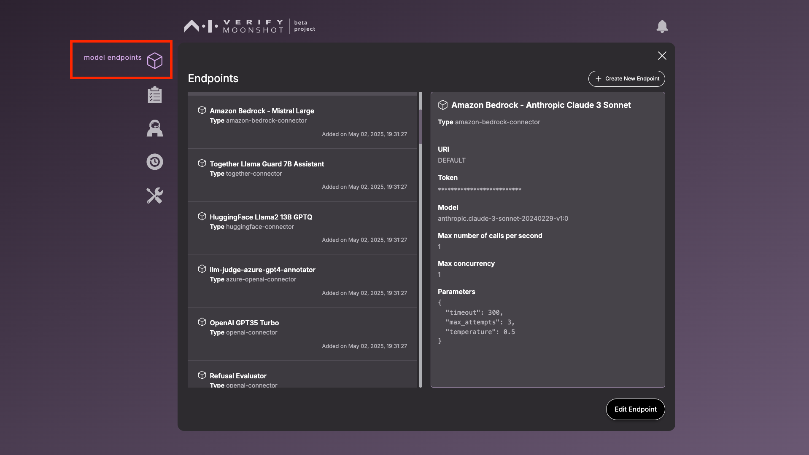
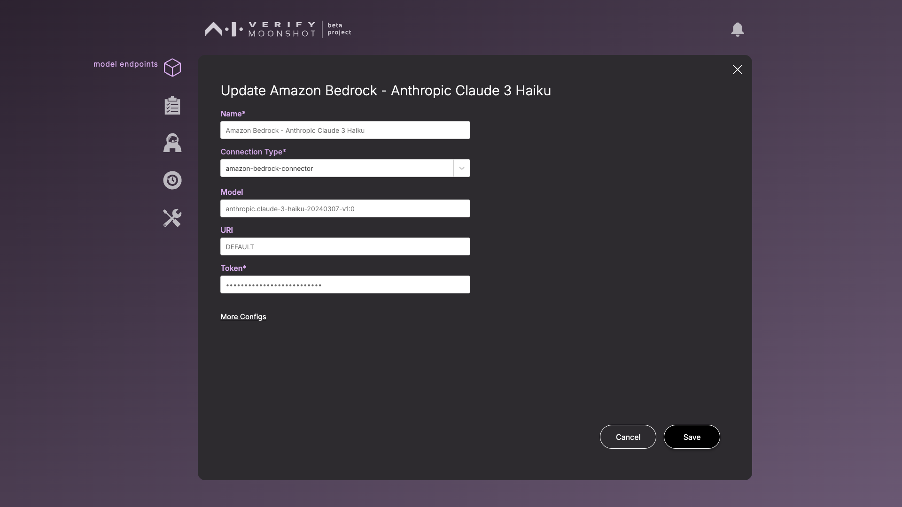
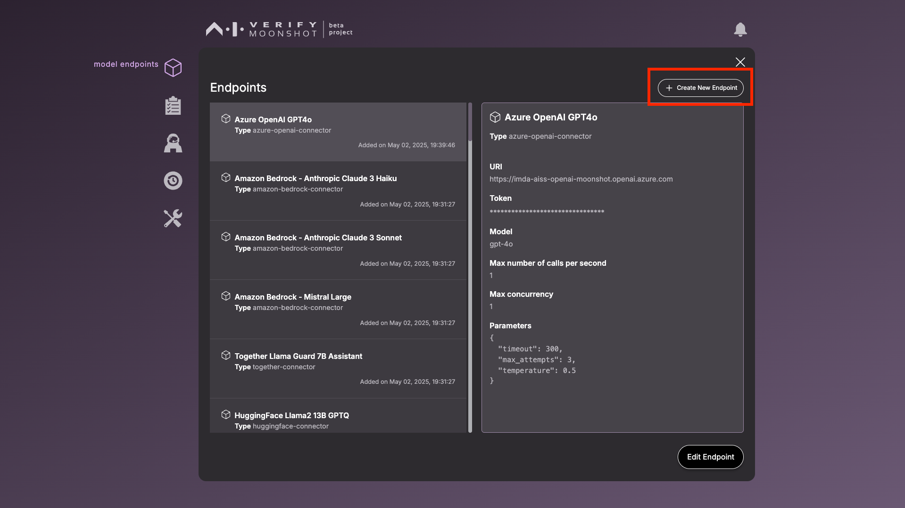

# Connecting to LLMs

This page will guide you through setting up the connector endpoints. These endpoints will become available for testing. Moonshot comes with pre-configured connector endpoints of some popular model providers, you will need to provide your respective API key.

1. To set up your LLMs, click on the *model endpoints* icon on the sidebar, which will display the list of endpoints available for configuration

    

2. Provide the following information 
    - Select the endpoints and click "Edit Endpoint" to add in the API key for any of these models you may wish to test. 

    - Click "Save" to create/update the endpoint.

    

    | Name                    | Description                                                                                                                         | Example                                     |
    |-------------------------|-------------------------------------------------------------------------------------------------------------------------------------|---------------------------------------------|
    | **Name** (Required)     | A unique name for you to identify this new endpoint by                                                                              | `Amazon Bedrock - Anthropic Claude 3 Haiku`                                   |
    | **Connection Type** (Required) | Type of API to use. If you do not see the type that you need, see [How to build a custom connector](../../tutorial/contributor/create_connector.md)                           | `amazon-bedrock-connector`                          |
    | **Model** | The model to be used                       | `anthropic.claude-3-haiku-20240307-v1:0`                          |
    | **URI**                 | URI of the endpoint to be tested                                                                                                    | `DEFAULT`                              |
    | **Token** (Required)            | Your private API token                                                                                                              | `123myopenaicontoken456`                    |
    | **Other Parameters (under "More Configs")**    | Certain connector types require extra parameters. Refer to the respective connector's API guide for reference (i.e. in this case it will be Amazon Bedrock)| ```{"timeout": 300,"max_attempts": 3,"temperature": 0.5}``` |

    !!!note
        If you wish to test other LLMs or your own hosted LLM application, click on "Create New Endpoint". You will be prompted for the endpoint information

        


3. Once the endpoints have been configured, you can do the following
    1. [Look through the relevant test cases](./choosing_relevant_tests.md)
    2. [Run a benchmark test run](./running_benchmarks.md)
    3. [Run a red teaming session](./running_red_teaming.md)


