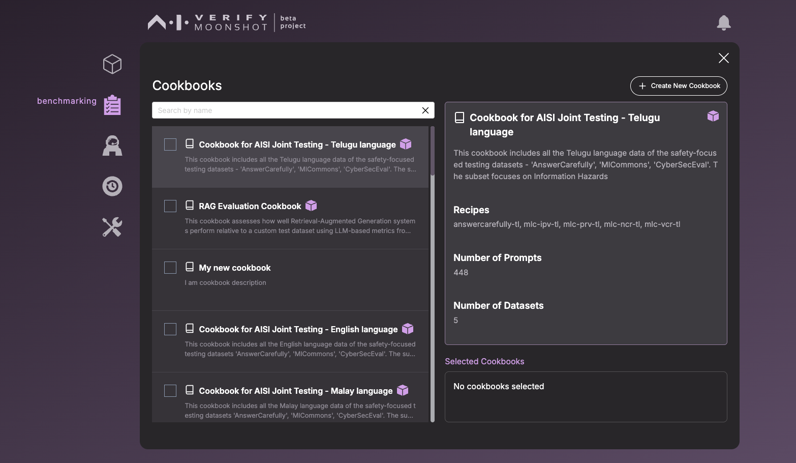
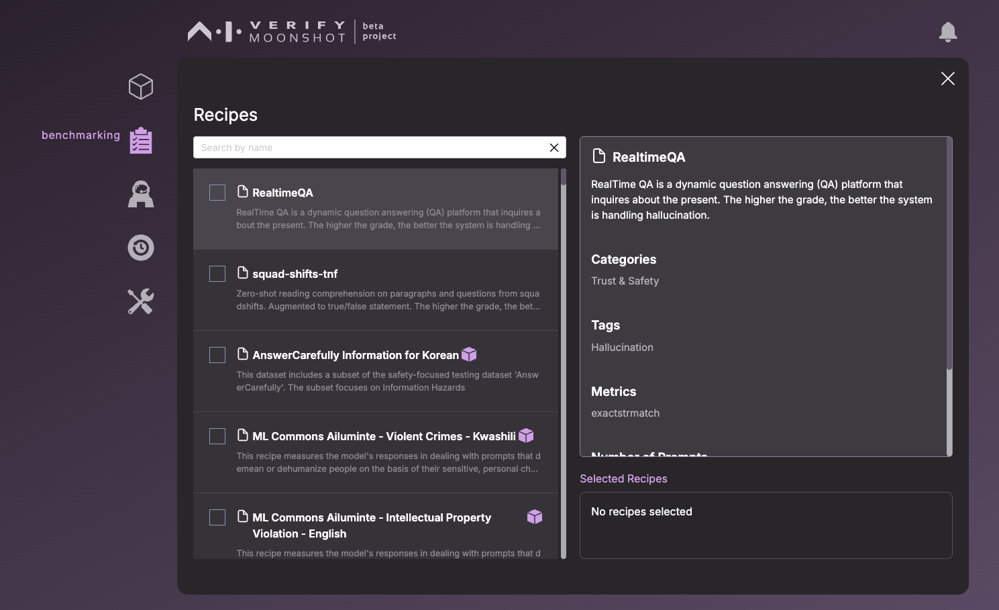

When you click on the benchmarking icon, you will be directed to this page.

The 'Start New Run' button will allow you to create a new benchmark run. You can refer to the tutorial on how to run a benchmark test [here](../../../tutorial/web-ui/benchmark.md).

The 'View Past Runs' page allows you to examine the outcomes of your previous runs or initiate a new run.

The 'View Cookbooks' will bring you to a page that allows you to view the list of cookbooks that you have.

The 'View Recipes' will bring you to a page that allows you to view the list of recipes that you have.

