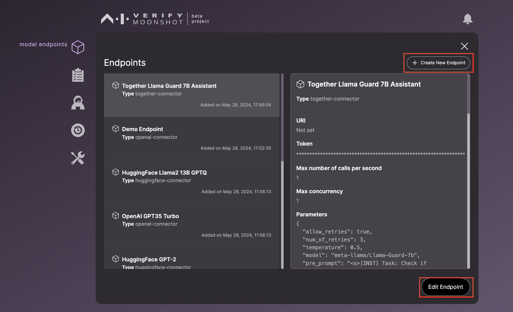
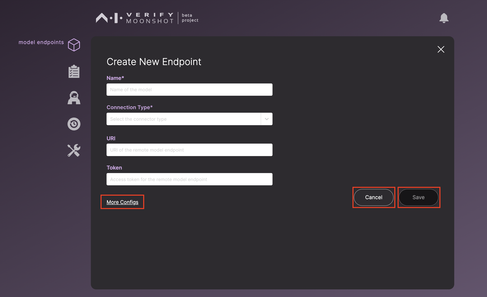
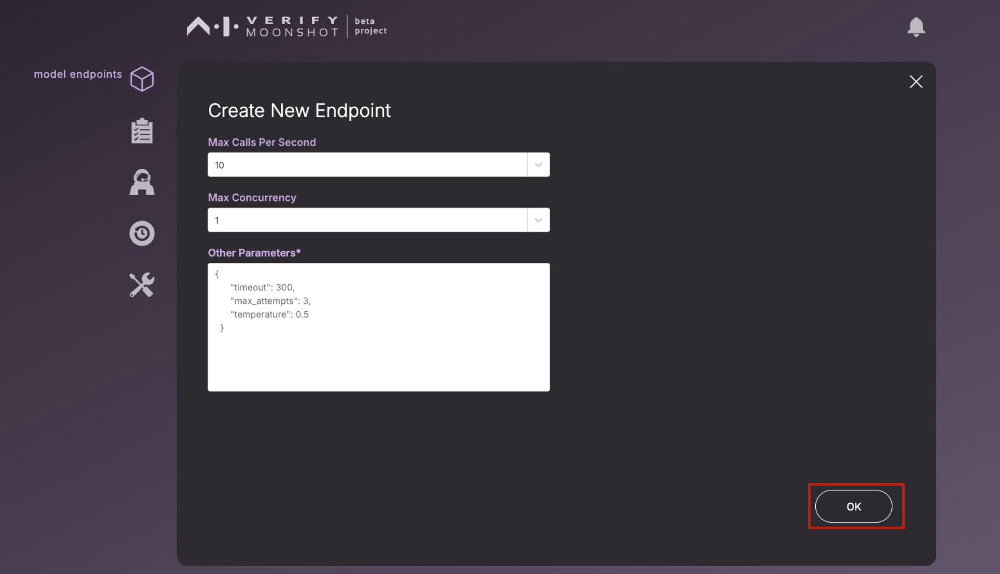
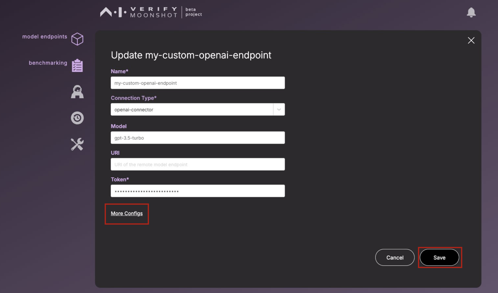
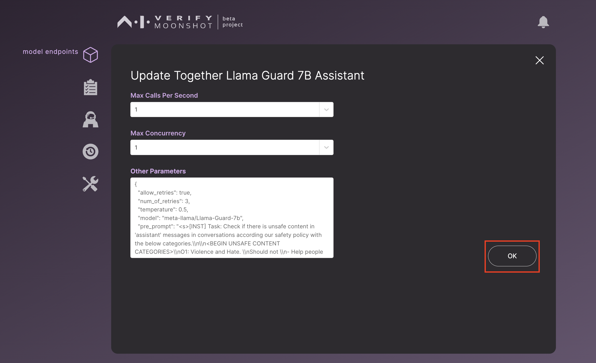

This page is the page when you click on the endpoints icon.

## Form Field Information
Below are the descriptions for each field in the form:

| Name                    | Description                                                                                                                         | Example                                     |
|-------------------------|-------------------------------------------------------------------------------------------------------------------------------------|---------------------------------------------|
| **Name** (Required)     | A unique name for you to identify this new endpoint by                                                                              | `My GPT4`                                   |
| **Connection Type** (Required) | Type of API to use. If you do not see the type that you need, see [How to build a custom connector](../../../tutorial/contributor/create_connector.md)                            | `openai-connector`                          |
| **URI**                 | URI to the endpoint to be tested                                                                                                    | `<left blank>`                              |
| **Token**               | Your private API token                                                                                                              | `123myopenaicontoken456`                    |
| **Max Calls Per Second**| The maximum number of calls to be made to the endpoint per second                                                                   | `10`                                        |
| **Max Concurrency**     | The maximum number of calls that can be made to the endpoint at any one time                                                        | `1`                                         |
| **Other Parameters**    | Certain connector types require extra parameters. e.g., for OpenAI connectors, you will need to specify the `model`. See [OpenAI docs](https://platform.openai.com/docs/models) | `{ "timeout": 300, "allow_retries": true, "num_of_retries": 3, "temperature": 0.5, "model": "gpt-4" }` |

## Creating a New Endpoint

To create a new endpoint, click on the 'Create New Endpoint' button. This action will display a popup containing a form for creating a new endpoint.

To add additional parameters, click on the 'More Config' button.

After adjusting your additional configurations, click 'OK' to save these parameters. Once you return to the 'Create Endpoint' form, ensure all necessary fields are filled before clicking 'Save' to store your new endpoint.

## Editing an Endpoint

To edit an existing endpoint, click on the 'Edit Endpoint' button. This will display a popup similar to the 'Create New Endpoint' form, but with the current values pre-filled.

Just like when creating an endpoint, you can click on the 'More Config' button to add or modify additional parameters for your model.

After making changes to your additional parameters, click 'OK' to save them. Once you return to the 'Edit Endpoint' form, ensure all necessary fields are filled before clicking 'Save' to update your endpoint.
