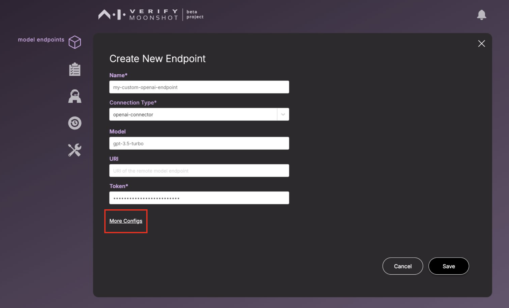

This page is the page when you click on the endpoints icon.

## Form Field Information
Below are the descriptions for each field in the form:

| Name                    | Description                                                                                                                         | Example                                     |
|-------------------------|-------------------------------------------------------------------------------------------------------------------------------------|---------------------------------------------|
| **Name** (Required)     | A unique name for you to identify this new endpoint by                                                                              | `My GPT4`                                   |
| **Connector Type** (Required) | Type of connector to use. If you do not see the type you need, see [How to build a custom connector](../../../tutorial/contributor/create_connector.md)                            | `openai-connector`                          |
| **URI**                 | URI to the endpoint to be tested                                                                                                    | `<left blank>`                              |
| **Token**               | Your private API token                                                                                                              | `123myopenaicontoken456`                    |
| **Max Calls Per Second**| The maximum number of calls to be made to the endpoint per second                                                                   | `10`                                        |
| **Max Concurrency**     | The maximum number of calls that can be made to the endpoint at any one time                                                        | `1`                                         |
| **Model**               | Thr model from the LLM you use to use                                                                                               | `gpt-4`                                         |
| **Other Parameters**    | Other parameters that the model requires/can take in.                                                                               | `{ "timeout": 300, "max_attempts": 3, "temperature": 0.5}` |

## Creating a New Endpoint

To create a new endpoint, click on the 'Create New Endpoint' button. This action will display a popup containing a form for creating a new endpoint. You can fill in the details of your new endpoint.
  

To add additional parameters, click on the 'More Configs' button.
  

After adjusting your additional configurations, click 'OK' to save these parameters. 
  

Once you return to the 'Create New Endpoint' form, ensure all necessary fields are filled before clicking 'Save' to store your new endpoint.
  

You should see your newly created endpoint in the list of endpoints.
  

## Editing an Endpoint

To edit an existing endpoint, click on the 'Edit Endpoint' button. This will display a popup similar to the 'Create New Endpoint' form, but with the current values pre-filled. You can click on the 'More Configs' button to edit other fields. When you are ready, click "Save".

