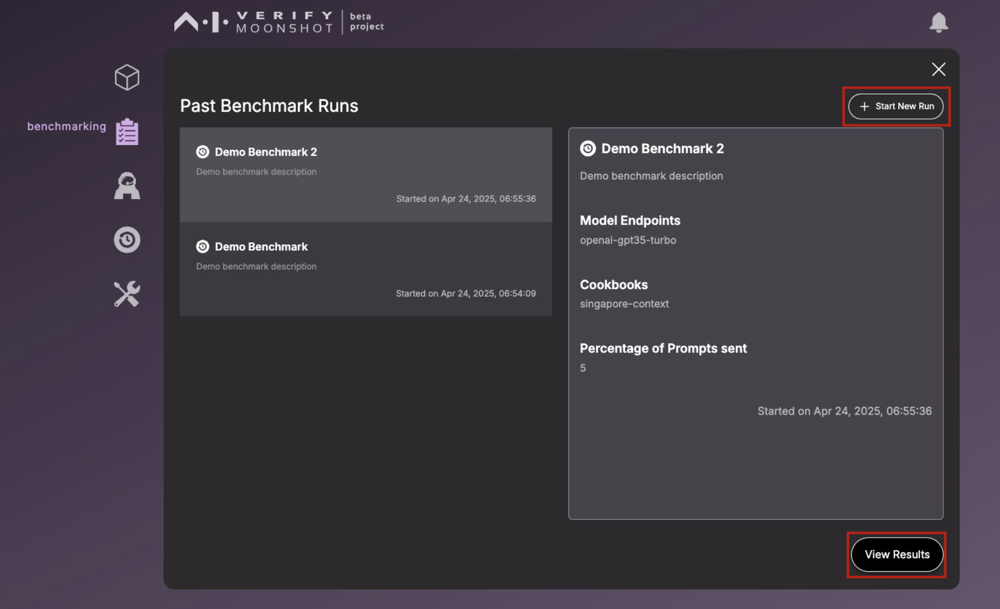

Upon clicking the history icon, you'll be navigated to a this history page.

This page provides you with the option to review your previous benchmark runs by clicking 'View Past Runs', or to revisit your past red teaming sessions by selecting 'View Past Sessions'.

The 'Past Benchmark Runs' page allows you to examine the outcomes of your previous runs or initiate a new run.

The 'Past Red Teaming Sessions' page offers the functionality to continue a paused red teaming session or to kick-off a new one.

