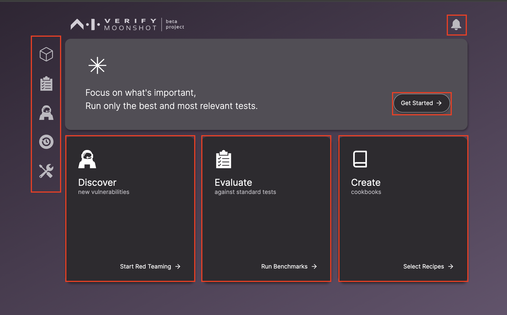

The Moonshot landing page appears when you first launch the UI.

## Sidebar

The sidebar contains several icons, each representing a different page within the Moonshot UI:

| Icon | Description |
|:----:|:-----------:|
|  | This icon directs you to the endpoint list page, where you can view, create, and manage your endpoints. |
|  | This icon takes you to the benchmarking page. Here, you can initiate benchmarking processes to evaluate your models against standard tests. |
|  | This icon leads you to the red teaming page. On this page, you can start a red teaming process to discover new vulnerabilities in your models. |
|  | This icon navigates you to the history page of your runs. Here, you can review the details and results of your past runs. |
|  | This icon guides you to the list of prompt templates and context strategies. These resources can help you customize your testing processes. |

## Discover new vulnerabilities

The "Discover new vulnerabilities" button initiates a red teaming process. Red teaming is a proactive approach to identifying vulnerabilities in your models before they can be exploited.

## Evaluate against standard tests

The "Evaluate against standard tests" button starts a benchmarking process. Benchmarking allows you to assess your models' performance against a set of standard tests, providing a comprehensive evaluation of their capabilities.

## Create Cookbooks

The "Create Cookbooks" button takes you to the cookbook creation page. Cookbooks are collections of recipes (tests) that you can run against your models. By creating your own cookbooks, you can curate a set of tests that are most relevant to your models' use cases.

## Initiating the Benchmarking Process

The "Get Started" button serves as your gateway to initiate a benchmarking process. By clicking on this button, you will be directed to the benchmarking setup page where you can configure and start the benchmarking process for your models.

## Monitoring the Benchmarking Run Status

The status of your benchmarking runs can be conveniently monitored through the bell icon located at the top right corner of the screen. A simple click on this icon will reveal a dropdown list displaying the status of all your ongoing and completed benchmarking runs.

For a more detailed view, you can click on any of the listed benchmarking runs. This action will navigate you to a dedicated page for that particular run. Here, you can delve into the specifics of the run, including its progress, results, and a comprehensive report detailing the performance of your model during the benchmarking process.
