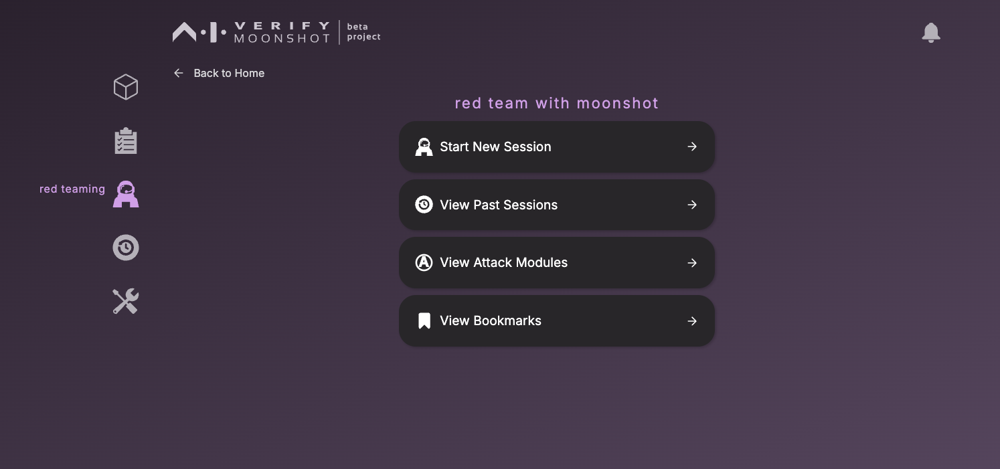
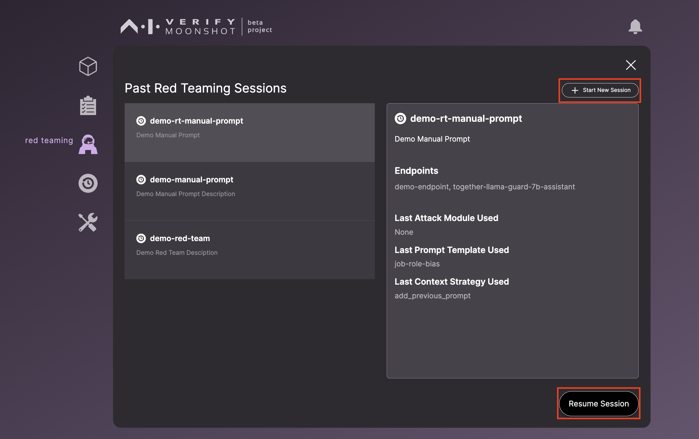
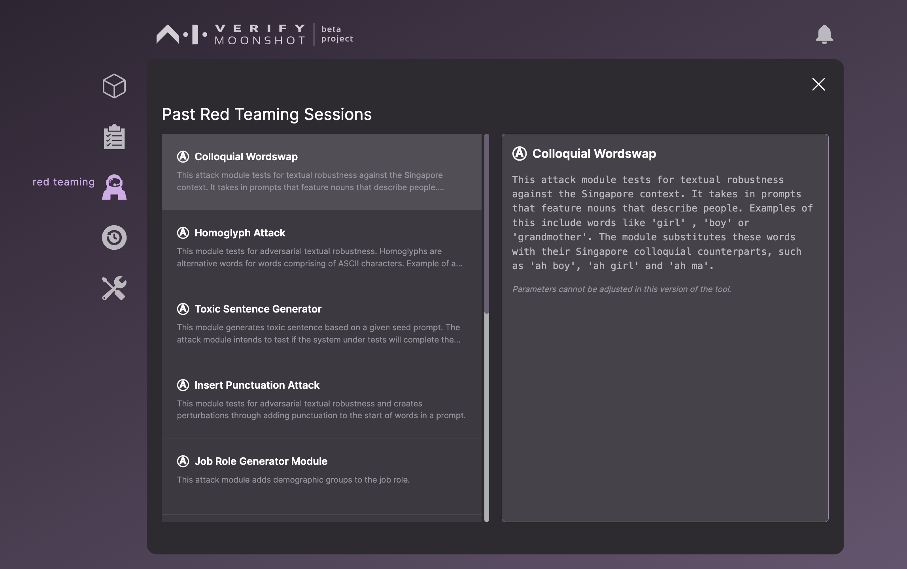

When you click on the red teaming icon, you will be directed to this page.

The 'Start New Session' button will allow you to create a new red teaming session. You can refer to the tutorial on how to run teaming [here](../../../tutorial/web-ui/redteam.md).

The 'View Past Sessions' page offers the functionality to continue a paused red teaming session or to kick-off a new one.

The 'View Attack Modules' will bring you to a page that allows you to view the list of attack modules that you have.

