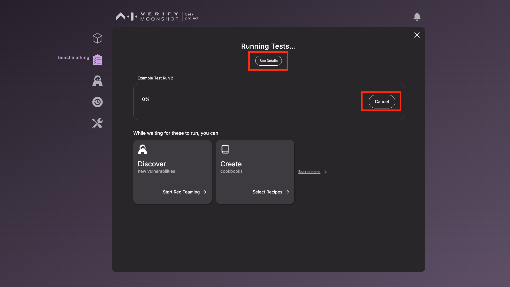
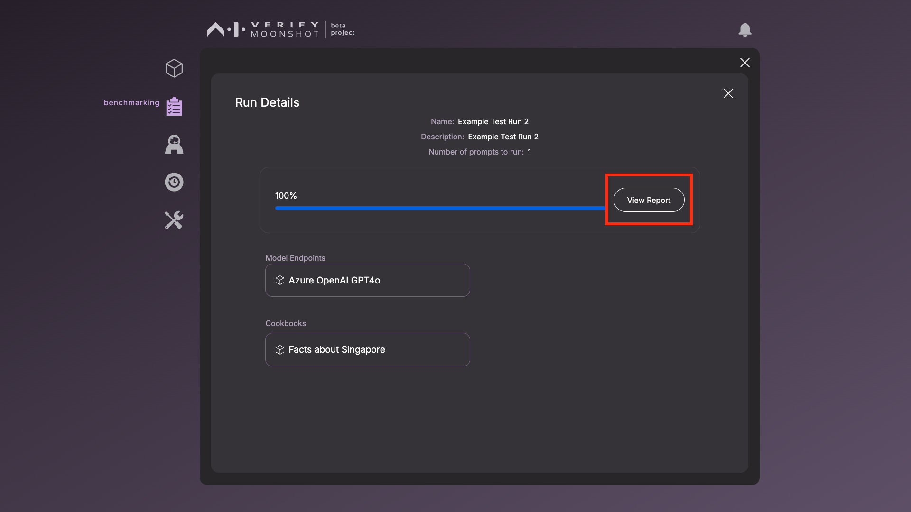

# Running Benchmarks

1. Before you can start running benchmarks, you have to provide the following information. These will be included in the report generated at the end of the run. 

    | Name        |Description   | Example          |
    |-------------------------|-------------------------------------------------------------------------------------------------------------------------------------|---------------------------------------------|
    | **Name** (Required)     | A unique name for you to identify this benchmark run by| `GPT4 vs Claude on safety benchmarks`  |
    | **Description** | Describe the purpose and scope of this benchmark run. | Comparing GPT4 and Claude to determine which model is safer as a chatbot |
    | **Run a smaller set** | The number of prompts per dataset, as specified in the recipe, to be run. Indicating 0 will run the full set.   <i>* Before running the full recommended set, you may want to run a smaller number of prompts from each recipe to do a sanity check.</i> | 5 |

2. Click ‘Run’ to start running the benchmarks. 

    

3. You can click on ‘See Details’ to recap on what is currently being run. 

    

4. A report will be generated once the run is completed. Meanwhile, you can:

    - Start Red Teaming to discover new vulnerabilities   
    - Create a custom cookbook by curating your own set of recipes   
    - Return back to the Main Page  

5. To view the progress of the run, click on the bell icon and select the specific benchmark run.

    

6. Once a benchmark run is completed, you can click on ‘View Report’ 

    

7. One report will be generated for each tested endpoint. Click on the dropdown to toggle the report displayed. You can also download the HTML report and the detailed results as a JSON file. 

    .png)

8. You can also view the details of previous runs through 2 methods
    1. By clicking on ‘benchmarking’ icon on the Sidebar and clicking the ‘View Past Runs’ button
    2. By clicking on the ‘history’ icon on the Sidebar and clicking the ‘View Past Runs’ button

    This is the window that will list the information of the previous runs. For more detailed information of each run, click in the "View Results" button