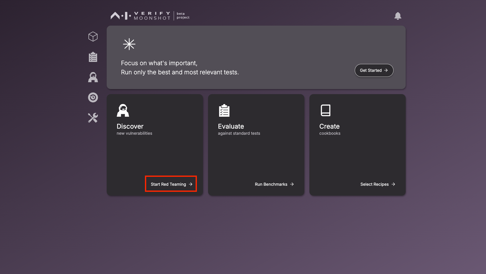
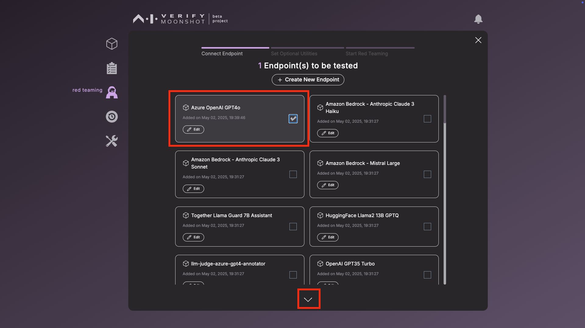
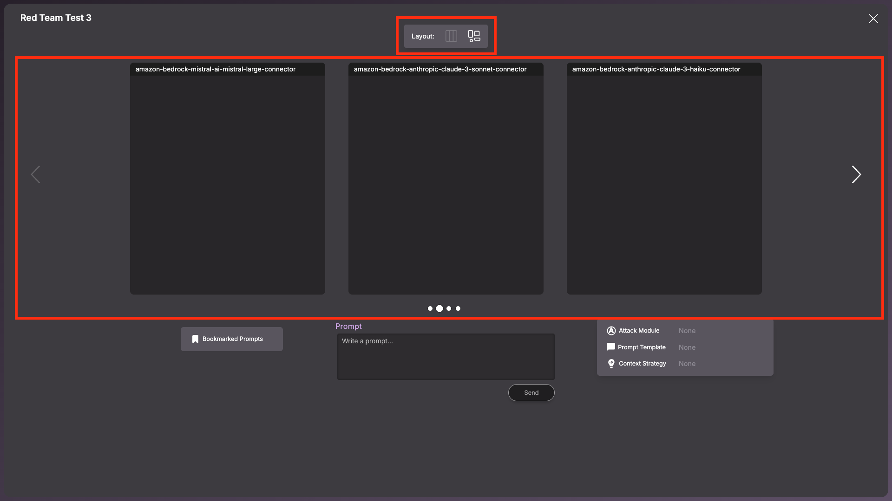
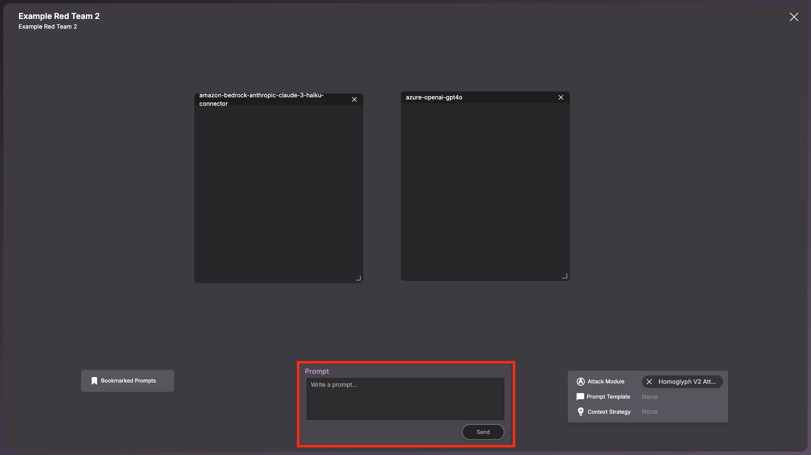
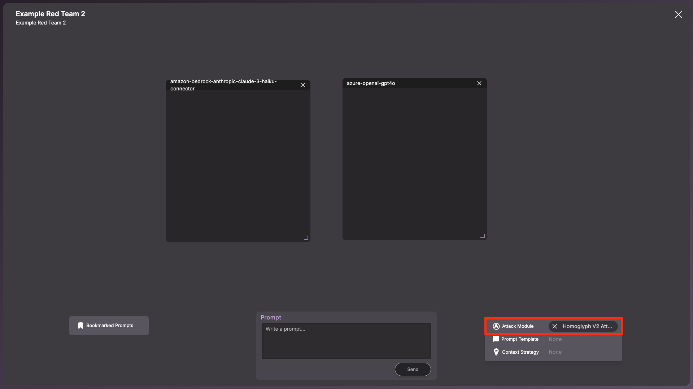
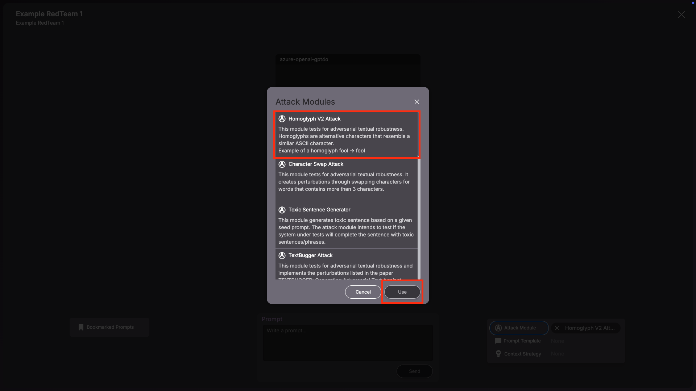
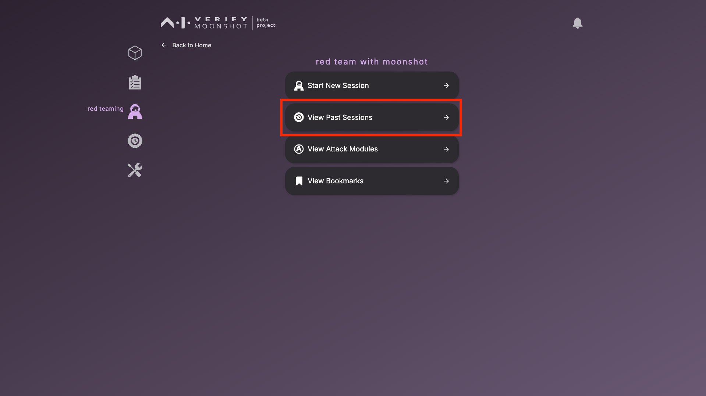
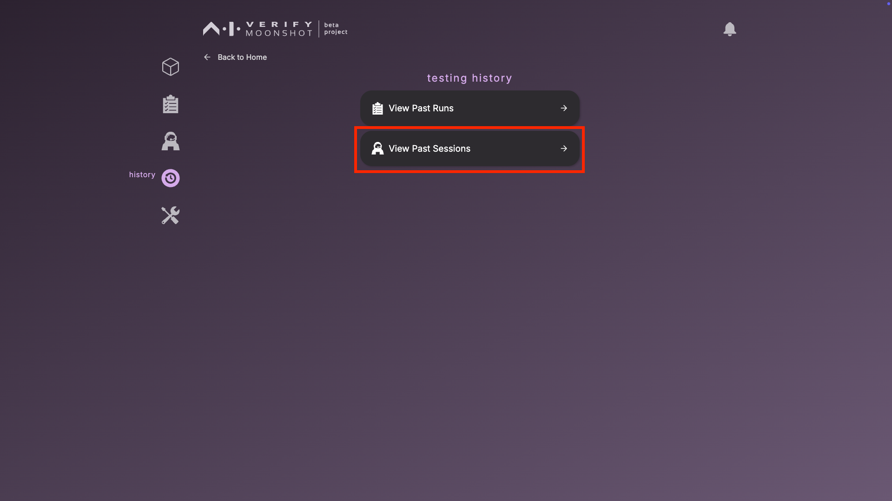
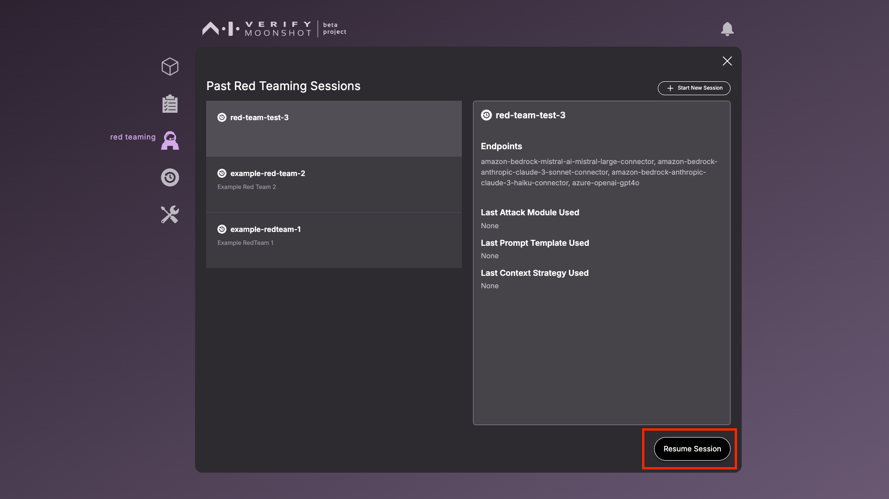

# Red Teaming

This page documents the steps for a red-teaming session.

1. To start a red teaming session, click on ‘Discover new vulnerabilities’

    

2. Select the endpoints to the LLMs that you wish to red team simultaneously within the same session and click the down arrow to move on.   <i>There is currently no limit to the number of endpoints you can red team at once, but we recommend to select a maximum of 5 endpoints for a smoother UX.</i>

    

3. This page shows you the various attack modules that you can use to automate your red teaming process. Each attack module provides a unique way to automatically generate prompts, based-off an initial prompt you provide. Some of these attack modules require the connection to a helper model e.g., GPT4. 

    !!! Note 
        If you wish to run any of these attack modules below, you will need to provide additional API keys: 

        1. Malicious Question Generator (Requires OpenAI’s GPT4) 

        2. Violent Durian (Requires OpenAI’s GPT4) 

        To configure the attack module endpoints, see [Connecting to LLMs](./connecting_to_llms.md)

    Select one attack module you would like to try out as a start and click the next button, or click on ‘Skip for now’:
    .png)
    You will still be able to select attack modules in the midst of a red teaming session. 

4. Before you can start the new red teaming session, provide the following information and click ‘Start’ to begin the new red teaming session. 

    |    Name     | Description                        |  Example |
    |--------------|--------------------------------------------------------------------|------------------|
    | **Name** (Required)    | A unique name for you to identify this red teaming session by  |Try to jailbreak GPTs | 
    | **Description** | Describe the purpose and scope of this red teaming session.   | Comparing GPT versions on resistance to various attack techniques  |

    .png)

---

**The Red Teaming Interface**

Chat boxes and Layout

Each chat box will allow you to view the prompt and response sent to or received from each endpoint.   

There are two layout options if you choose more than 3 endpoints:   
1. Carousel  
2. Free Layout, which allows you to re-arrange, re-size and minimise the chat boxes. 

**Sending Prompts**

Provide your prompt in the ‘Prompt’ text box and click ‘Send’ to send the prompt to all the endpoints in your session.

**Red Teaming Tools** 

You can use some of these tools to enhance your red teaming process: 

1. **Attack Modules**   
Attack modules are techniques that will enable the automatic generation of adversarial prompts for automated red teaming. Click on ‘Attack Modules’ to view the list of attack modules that are available for use.

    
To activate a red teaming module, select the desired attack module and click on the ‘Use’ button.

- Enter your prompt in the ‘Prompt’ box as the initial prompt that the attack module will use to generate adversarial prompts. 

- Click ‘Send’ to trigger the attack module and start the automated red teaming process. Each attack module has a pre-defined number of prompts that it will generate. 

!!!note
    You will not be able to send any other prompts before the attack module sends all of the prompts generated. 

.png)

To remove the attack module, click on 'X' to remove the attack module set.
.png)

    
1. **Prompt Templates**  

Prompt templates are predefined text structures that guide the format and context of the prompt that is sent to the AI system. Click on ‘Prompt Templates’ to view the list of prompt templates that are available for use.  
.png)

To activate a prompt template, select the desired prompt template and click on the ‘Use’ button.
.png)

Enter your prompt in the ‘Prompt’ box. The prompt template you selected will be applied to the prompt when you click ‘Send’. 
.png)

Hover your mouse over each prompt to view its details. 

.png)

Click on ‘X’ to remove the prompt template set. 
.png)

2. **Context Strategies**  

Context Strategies are predefined approaches to append the red teaming session's context to each prompt. Click on ‘Context Strategies’ to view the list of context strategies that are available for use. 
    
.png)

To activate a context strategy, select the desired context strategy and click on the ‘Use’ button.
.png)

Enter your prompt in the ‘Prompt’ box. Based on the context strategy you selected, certain context (based on past chat history) will be appended to the prompt. 

Click on ‘X’ to remove the context strategy set. 
.png)

**Ending a Session** 
All sessions are being saved in real time, you can click on the ‘X’ button to end a session and resume it later.   
.png)

Click on 'Exit'.  
.png)

**Resuming a Session**

8. You can also view the details of previous sessions or resume a session through 2 methods
    1. By clicking on 'red teaming' icon on the Sidebar and clicking the ‘View Past Sessions' button

    

    2. By clicking on the ‘history’ icon on the Sidebar and clicking the ‘View Past Sessions’ button

    

    This is the window that will list the information of the previous redteam session. You can also resume a past session if desired.

    

