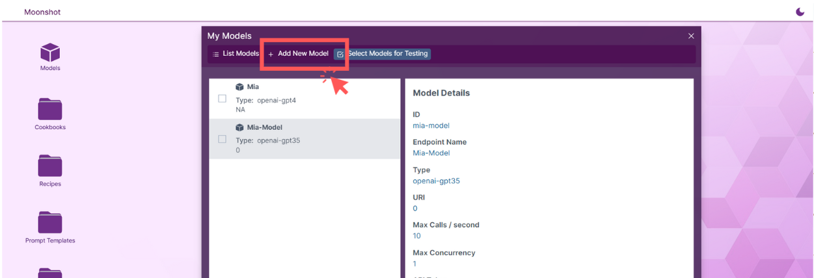
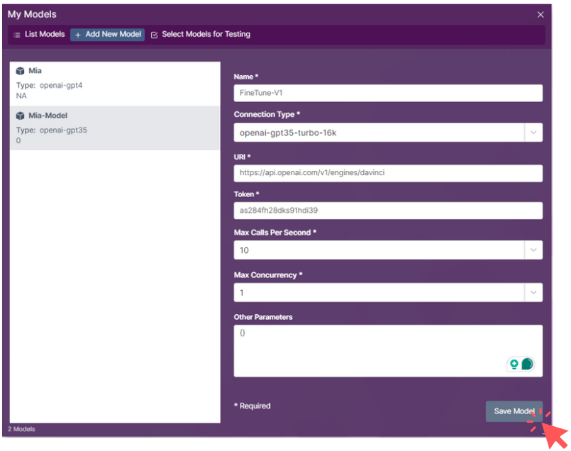
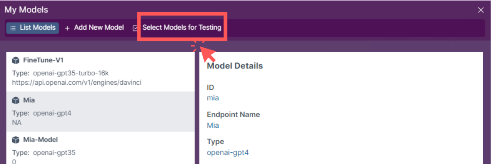

# Model Endpoint
Upon opening the Web UI, the user is presented with a desktop interface.

## Selecting Models Folder
Click on the **Models** icon on the desktop.

## Add New Endpoint
In the pop-up **Models** window, select **Add New Model**.

A form will appear, prompting you to fill in the necessary fields.

`Other Paramters` is an optional field. If there are specific parameters to set for the endpoint, the user can fill them in this field.

## Create Endpoint
After filling in the required fields, click on the **Save Model** button.

Upon successful creation of the endpoint, the newly created model is displayed in the left column of the popup.

## Selecting Models
Click on the **Select Models for Testing** option from the sidebar menu.

This action leads to a page where you can see the list of available models, including the one you just created.

## Choosing Action
With the model selected, you now have the option to: 

- Start Benchmarking
- Start Red Teaming

